# Vehicle Safety Research: Multi-Phase Research Framework for Proactive Vehicle Safety and VRU-Aware Risk Communication

**Tagline:** *"From Crash Prediction to Proactive, Explainable Safety Intelligence"*

[](https://www.python.org/downloads/)
[](https://opensource.org/licenses/MIT)
[](https://github.com/joyjitroy/Vehicle_Safety_Research)

# <span style="color:blue">Project Overview</span>

Vehicle_Safety_Research is a multi-phase research program that moves from reactive crash prediction to proactive, explainable safety intelligence for both human-driven and automated vehicles. Phase 1, SafeDriver-IQ, transforms national crash and naturalistic driving data into a continuous 0-100 safety score that tells drivers in real time how close they are to crash conditions and what specific actions would make them safer. Phase 2, PRISM, extends this into an agentic multi-model architecture that fuses environmental, trajectory, and VRU-interaction risks through reinforcement learning. Phase 3, PRISM-AR, maps these internal risk states to adaptive augmented-reality cues for pedestrians and cyclists. All three phases share the same inverse risk-scoring foundation and focus on protecting vulnerable road users (VRUs).

### Comprehensive Crash Factor Investigation (Notebook 04)
A deep-dive multi-dataset investigation combining **CRSS** (417K crashes) and **Waymo Open Motion Dataset** to answer 8 core research questions:
1. What factors contribute to vehicle crashes?
2. Which features best predict crash probability?
3. How to classify driver behavior from crash and good-driving data?
4. What data is most critical for VRU/pedestrian/cyclist predictions?
5. What patterns can improve crash prevention model training?
6. What historical crash trends are present across 2016–2023?
7. What environmental conditions uniquely elevate crash risk?
8. How to systematically perform root cause analysis?

**Key addition — Contextual Feature Synthesis:** CRSS captures crash *outcomes* but is silent on contextual preconditions. A new `ContextualFeatureGenerator` synthesises 16 research-calibrated risk dimensions (see [Section 6](#section-6--comprehensive-crash-factor-analysis-beyond-crss-data) in notebook 04) drawn from NHTSA, FHWA-HSM, AAA Foundation, and IIHS sources, enabling richer training and what-if simulation.

### 🤖 Real-Time Agentic Decision Layer (Phase 1 extension)
A rule/RL-based decision layer (`phase1-safedriver-iq/src/agent/`) wraps the Phase 1 tabular safety score with **autonomous decision-making**:
- Real-time risk assessment and autonomous interventions
- Continuous learning from driving experiences
- Multi-modal driver notifications (visual, audio, haptic)
- Transparent, explainable AI reasoning
- Code: [`phase1-safedriver-iq/src/agent/core/`](phase1-safedriver-iq/src/agent/core/) (decision engine) · [`phase1-safedriver-iq/src/agent/perception/`](phase1-safedriver-iq/src/agent/perception/) · [`phase1-safedriver-iq/src/agent/control/`](phase1-safedriver-iq/src/agent/control/) · [`phase1-safedriver-iq/src/agent/learning/`](phase1-safedriver-iq/src/agent/learning/) · [`phase1-safedriver-iq/src/agent/explainability/`](phase1-safedriver-iq/src/agent/explainability/) — see [`phase1-safedriver-iq/demo_agentic_ai.py`](phase1-safedriver-iq/demo_agentic_ai.py) to run it

> **Note:** This is a Phase 1 add-on around the single tabular safety-score model, not to be confused with **PRISM (Phase 2)**, which independently fuses three separate risk models (environmental, trajectory, VRU) via its own RL agent — see below.

### The Problem
- **7,500+ pedestrian deaths/year** in the USA (40-year high)
- **1,000+ cyclist deaths/year**
- Traditional systems are **reactive** (emergency braking) not **proactive**
- No system tells drivers "you're driving safely" or "improve these specific behaviors"

### Our Solution
Instead of predicting crashes, we model the **distance from crash** - quantifying how "safe" a driving scenario is by measuring its statistical distance from crash-producing conditions.

### 🕶️ PRISM-AR: Risk-Adaptive AR Cues for VRUs (extends PRISM / Phase 2)
PRISM-AR (in [`phase3-prism-ar/`](phase3-prism-ar/)) takes PRISM's continuous safety score and intervention tier and maps them to **adaptive augmented-reality cues** for pedestrians and cyclists — e.g., a translucent amber safe zone at "advisory", a flashing red no-cross boundary at "emergency". It is being prepared for submission to **IEEE Transactions on Vehicular Technology**. See [`phase3-prism-ar/README.md`](phase3-prism-ar/README.md) for details.

# <span style="color:blue">Research Publication</span>

This repository serves as the **reference implementation and experimental foundation** for the following research:

### Phase 2: PRISM

Phase 2 of this research, an agentic multi-model architecture for proactive safety intervention in autonomous transportation, has been accepted for presentation at the **American Society of Civil Engineers (ASCE) 2027** conference. Validation artifacts are in the [`phase2-prism/asce2027/`](phase2-prism/asce2027/) directory.

### Key Results (Phase 2)

- **1,296 scenarios** validated across nuScenes (10), Argoverse 2 (1,000), and Waymo WOMD (286)
- **Mean safety score: 68.0/100**
- **77.6%** of scenarios classified as **advisory**
- **3.8% near-miss rate**
- **~11%** escalated to **intervention/emergency**
- Cross-dataset calibration without retraining

### Phase 3: PRISM-AR

**Paper Title:** *Explainable Risk-Adaptive Driving Intelligence for Vulnerable Road User Communication in Automated Vehicles*

Phase 3 extends PRISM's internal AV risk reasoning into external, VRU-facing communication. PRISM-AR (PRISM with Augmented Reality) adds a tiered external communication policy that maps PRISM's fused risk state to adaptive AR cues for pedestrians and cyclists across four escalation levels: silent, information, warning, and emergency. Prepared for submission to **IEEE Transactions on Vehicular Technology (TVT)**, Special Issue on Advanced Driving Intelligence for Autonomous Vehicles (manuscript deadline: 1 August 2026). Source and validation artifacts are in the [`phase3-prism-ar/`](phase3-prism-ar/) directory.

**Authors:** Joyjit Roy, Meng Lu, Arijit Roy, Sushanta Das, Samaresh Kumar Singh

### Key Results (Phase 3)

- **231 scenario clips** evaluated across three public AV datasets plus controlled near-miss scenarios
- Proxy ground-truth tier accuracy improves from **0.43 (static eHMI)** to **0.71 (PRISM-AR)**
- Cue-risk monotonicity: Spearman **ρ = -0.703** (Wilcoxon p < 0.0001)
- Activates warning/emergency cues in risk-critical cases the static baseline fails to escalate
- Sub-millisecond per-frame latency (reference implementation)

### 📌 Relationship to This Project
Each phase of the SafeDriver-IQ system was **designed, implemented, and validated first**, and the insights, models, and experimental findings from this project directly led to the corresponding research publications: the Phase 1 arXiv paper, the Phase 2 ASCE2027 paper, and the Phase 3 PRISM-AR manuscript prepared for IEEE TVT.

In other words:
- ✅ This repository = **working system + experiments** (Phase 1: `phase1-safedriver-iq/`, Phase 2: `phase2-prism/`, Phase 3: `phase3-prism-ar/`)
- ✅ The papers = **formalization of methodology, results, and contributions** for each phase

### 🚀 What the Paper Formalizes
The research paper builds on this project and formally introduces:

- **Inverse Crash Probability Modeling** → foundation of the safety score  
- **Continuous Driver Safety Scoring (0–100)** instead of binary crash prediction  
- **Distance-from-crash formulation** using learned decision boundaries  
- **Integration of crash data (CRSS) + behavioral data (Waymo)**  
- **Explainable safety feedback mechanisms for real-time systems**  

### 🔬 How This Repo Maps to the Paper

| Research Concept | Implementation in This Repo |
|----------------|---------------------------|
| Inverse crash modeling | `phase1-safedriver-iq/src/safety_score.py` |
| Feature engineering (120+) | `phase1-safedriver-iq/src/feature_engineering.py` |
| Contextual risk synthesis | `phase1-safedriver-iq/src/contextual_feature_generator.py` |
| Model training (RF/XGBoost) | `phase1-safedriver-iq/src/models.py` |
| Behavioral insights | `phase1-safedriver-iq/src/driver_behavior_classifier.py` |
| Explainability (SHAP) | `phase1-safedriver-iq/notebooks/03_shap_analysis.ipynb` |
| Real-time scoring system | `phase1-safedriver-iq/src/realtime_calculator.py` |


# <span style="color:blue">Phase 1: SafeDriver-IQ - Real-Time Driver Safety Scoring Through Inverse Crash Probability Modeling</span>

### Overview

SafeDriver-IQ is the first phase of the Vehicle_Safety_Research program. It introduces a framework that transforms binary crash classifiers into continuous 0-100 safety scores by combining national crash statistics with naturalistic driving data from autonomous vehicles. The framework was presented at IEEE EIT 2026 and is forthcoming in IEEE Xplore.

### Research Flyer

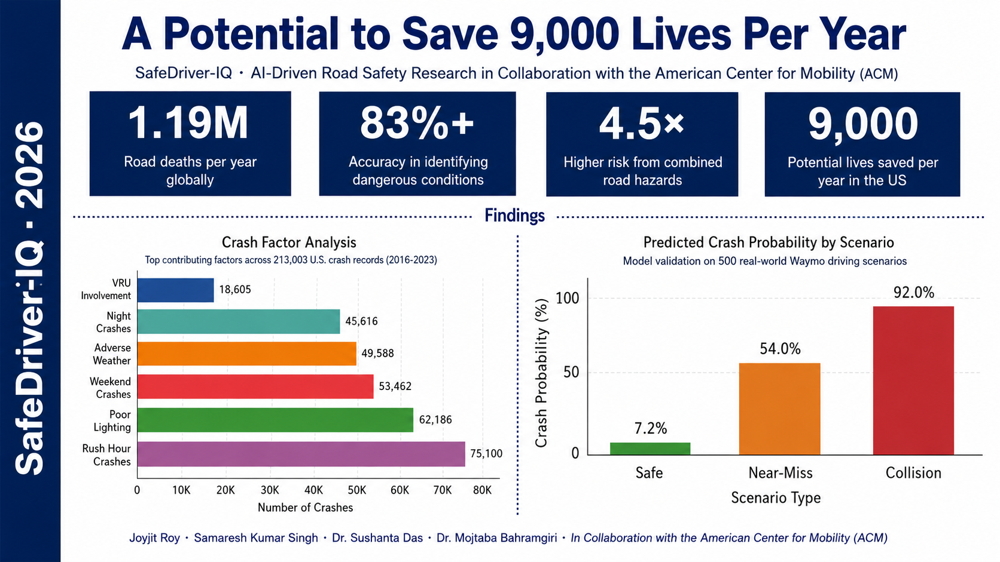

Phase 1 introduces inverse crash probability modeling: a continuous 0–100 safety score derived from NHTSA CRSS crash data and Waymo driving behavior, demonstrating that 87% of crashes involve two or more co-occurring risk factors.

### Abstract

Road crashes remain a leading cause of preventable fatalities. Existing prediction models predominantly produce binary outcomes, which offer limited actionable insights for real-time driver feedback. These approaches often lack continuous risk quantification, interpretability, and explicit consideration of vulnerable road users (VRUs), such as pedestrians and cyclists.

SafeDriver-IQ fuses National Highway Traffic Safety Administration (NHTSA) crash records with Waymo Open Motion Dataset scenarios, engineers domain-informed features, and incorporates a calibration layer grounded in transportation safety literature. Evaluation across 15 complementary analyses indicates that the framework reliably differentiates high-risk from low-risk driving conditions with strong discriminative performance. Findings reveal that 87% of crashes involve multiple co-occurring risk factors, with non-linear compounding effects that increase the risk to 4.5x baseline. SafeDriver-IQ delivers proactive, explainable safety intelligence relevant to advanced driver-assistance systems (ADAS), fleet management, and urban infrastructure planning.

### 1. Introduction

Road traffic crashes are a leading cause of preventable mortality worldwide, with approximately 1.19 million fatalities annually. In the United States, NHTSA documented 40,990 traffic fatalities in 2023, and pedestrian and cyclist fatalities have increased by more than 50% over the past decade. Vehicle safety technologies have advanced, yet VRU fatalities continue to rise, highlighting a significant gap in vehicle-centric safety strategies.

Crash prediction models estimate the likelihood of a crash based on environmental and operational conditions. While valuable for infrastructure planning and hotspot identification, they offer limited utility for real-time driver feedback. Binary outputs such as "crash likely" or "crash unlikely" provide minimal actionable information. They do not convey the degree of risk or identify which factors contribute to it.

This project introduces **Inverse Crash Modeling**, a paradigm that converts binary crash classifiers into continuous safety scoring systems. SafeDriver-IQ quantifies the distance between current driving conditions and crash-producing scenarios as a continuous score from 0 to 100. The transformation uses posterior class probabilities from a trained crash classifier, with the probability of not crashing as the safety score. A well-calibrated classifier preserves these gradations, whereas conventional binary thresholding discards them.

#### Key contributions

1. **Inverse Crash Modeling Formulation** - formalizes the transformation of binary crash classifiers into continuous safety scoring functions.
2. **Dual-Dataset VRU Safety Assessment** - integrates NHTSA CRSS crash data with the Waymo Open Motion Dataset.
3. **Domain-Knowledge Calibration** - a rule-based calibration layer bridges statistical prediction with transportation safety expertise.
4. **Driver Behavior Classification and Multi-Factor Risk Analysis** - identifies four crash-involved driver profiles and demonstrates non-linear compounding effects reaching 4.5x baseline crash risk.
5. **Comprehensive Empirical Validation** - 15 analyses including ablation, cross-validation, SHAP interpretability, and real-world impact simulation demonstrate framework robustness.

### 2. Architecture

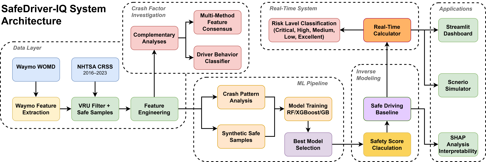

The full system architecture has four main layers:

#### Data layer

SafeDriver-IQ employs a dual-dataset strategy:

- **NHTSA CRSS (2016-2023)** - 417,335 crash-level records across 11 linked tables. After VRU filtering and deduplication, 23,194 unique VRU crash records remain.
- **Waymo Open Motion Dataset v1.2** - 500 parsed scenarios at 10 Hz over 9.1-second windows, including 9 collisions, 27 near-misses, and 464 safe-driving episodes.

Synthetic safe samples are generated by modifying high-risk CRSS features to safer values and validating them against Waymo safe-driving behavior, yielding a balanced 1:1 training set of 46,388 records.

#### Feature engineering

The pipeline produces 64 numeric features organized into 7 groups:

- **Temporal** (10): HOUR, MINUTE, MONTH, DAY WEEK, IS RUSH HOUR, IS WEEKEND
- **Environmental** (6): WEATHER, ADVERSE WEATHER, LGT COND, POOR LIGHTING
- **Location** (8): TYP INT, REL ROAD, WRK ZONE, INT HWY
- **VRU-Specific** (5): pedestrian count, cyclist count, total VRU, max VRU injury, fatal VRU
- **Interaction** (3): NIGHT AND DARK, WEEKEND NIGHT, ADVERSE CONDITIONS
- **Crash & Vehicle** (24): HARM EV, MAN COLL, ALCOHOL, MAX SEV, VE TOTAL, PEDS
- **Metadata** (8): STRATUM, REGION, URBANICITY, PJ, PSU VAR

Interaction features explicitly model compound risk scenarios such as dark combined with adverse weather.

#### Model training

Two training pipelines are used:

- **Pipeline 1: Model selection** - Random Forest, XGBoost, and Gradient Boosting are evaluated with 100 estimators and a stratified 80/20 train-test split. Random Forest is selected as the production model.
- **Pipeline 2: Feature importance and SHAP analysis** - RF and XGBoost are retrained with 200 estimators to produce stable TreeSHAP values, ablation AUC deltas, and permutation importance rankings.

#### Inverse safety score formulation

The central component of SafeDriver-IQ is the inversion of crash probability into a continuous safety score. Given a trained binary classifier and a feature vector representing current driving conditions, the raw safety score is:

**S_raw(x) = P(y = 0 | x) x 100**

where P(y = 0 | x) is the posterior safe class probability. The score is bounded, monotonic, continuous, and interpretable. A score of 75 means the model estimates a 75% probability that current conditions do not match crash patterns.

#### Domain-knowledge calibration

A multiplicative calibration layer corrects systematic model bias. Condition-specific penalty factors are derived from safety literature for road surface, weather, lighting, speed, VRU presence, and compound conditions. For example, an icy road applies a 40% penalty (alpha = 0.60), and darkness applies up to a 25% penalty.

#### Real-time system

The calibrated safety score is produced in under one millisecond from a 64-feature driving context vector. It supports configurable intervention thresholds for ADAS, fleet management, and insurance telematics.

#### SHAP-based interpretability

TreeSHAP computes Shapley values for each feature, supporting both global feature ranking and local explanation of individual scores. A negative SHAP value pushes the prediction toward crash conditions, lowering the safety score and enabling targeted recommendations.

### 3. Dataset Summary

| Component | Records | Description |
|---|---|---|
| CRSS ACCIDENT | 417,335 | Crash-level records (2016-2023) |
| CRSS VEHICLE | 469,443 | Vehicle involvement |
| CRSS PERSON | 655,675 | Person involvement |
| PBTYPE | 25,519 | Pedestrian/cyclist typing |
| +7 supplementary | - | Factor, distraction, impairment |
| WOMD parsed | 500 | 10 Hz, 9.1 s windows |
| WOMD collisions | 9 | 1.8% of scenarios |
| WOMD near-misses | 27 | 5.4% of scenarios |
| WOMD safe driving | 464 | 92.8% of scenarios |
| VRU crashes (after filter) | 23,194 | Pedestrian or cyclist involved |
| Safe samples | 23,194 | Synthetic + Waymo-validated |
| Total balanced | 46,388 | 1:1 crash-to-safe ratio |
| Training set | 37,110 | 80% stratified split |
| Test set | 9,278 | 20% stratified split |
| Numeric features | 64 | 7 feature groups |

### 4. Results

#### Precision-recall

The model attains an Average Precision (AP) of **0.891**, well above the 0.500 random baseline. At the default threshold of 0.5, the model achieves precision = **0.941** and recall = **0.480**.

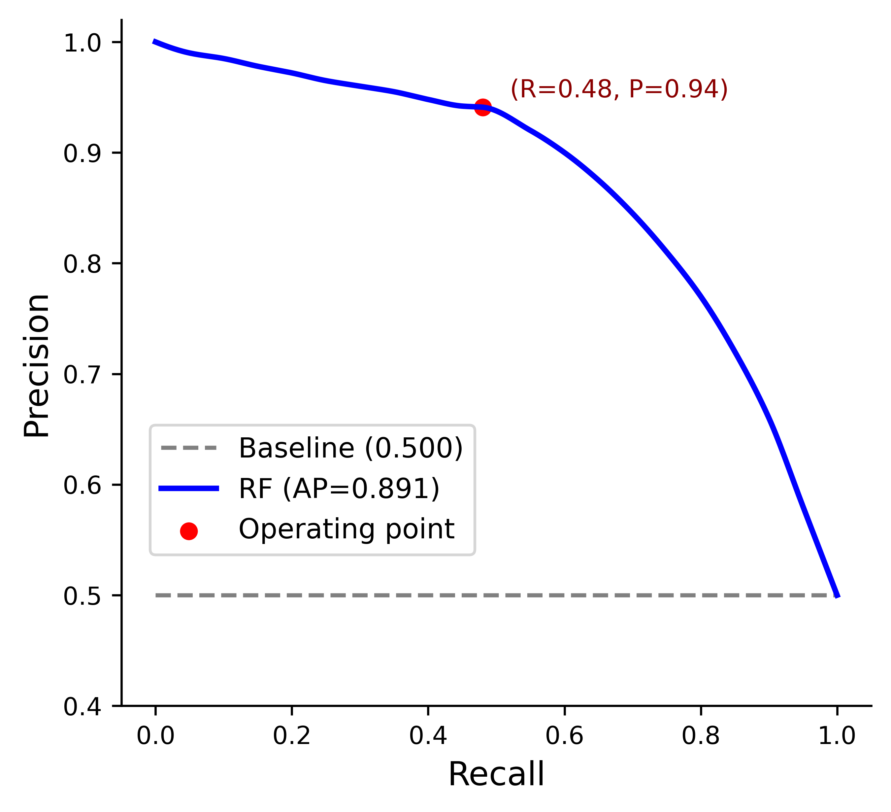

#### Confusion matrix

The Random Forest model on the held-out test set (9,278 samples) shows:

- High safe-class recall: **0.970**
- High crash-class precision: **0.941**
- Moderate crash-class recall: **0.480**
- Crash-class F1-score: **0.636**

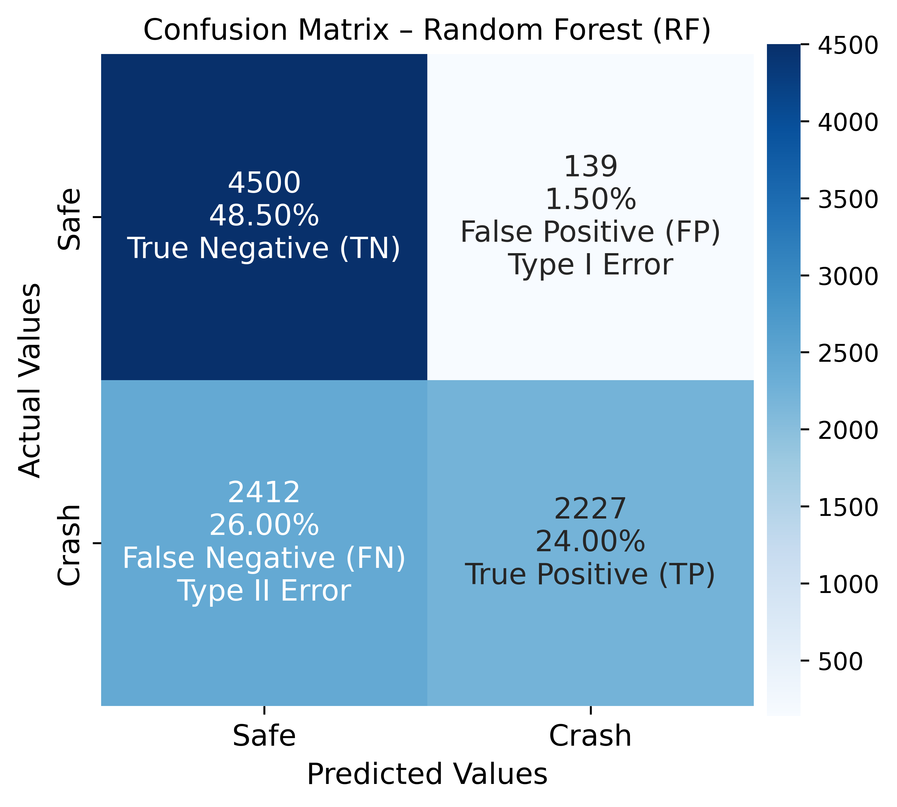

#### Risk level classification

A synthetic evaluation grid of 864 driving scenarios achieves **87.0%** overall accuracy across five risk levels. Every misclassification falls between adjacent levels, showing ordinal consistency.

#### Crash factor analysis

From the CRSS 2016-2023 subset (213,003 crashes), the most prevalent primary factors are:

- Rush hour: 75,100 (35.3%)
- Poor lighting: 62,186 (29.2%)
- Weekend driving: 53,462 (25.1%)
- Adverse weather: 49,588 (23.3%)
- Night driving: 45,616 (21.4%)
- VRU involvement: 18,605 (8.7%)

VRU crashes rank last by count but carry disproportionate severity, motivating the VRU focus of SafeDriver-IQ.

#### Ablation study

Lighting is the most critical feature group: removing it drops ROC-AUC by **7.6%**. Environmental features rank second at **-6.5%**. Removing lighting and environmental features together produces a **16.4%** AUC drop, demonstrating non-linear compounding beyond the additive expectation of 14.1%. VRU-specific features contribute **0.8%** independently.

#### SHAP interpretability

TreeSHAP values identify lighting, weather, and road condition as dominant global drivers of risk, consistent with the ablation findings.

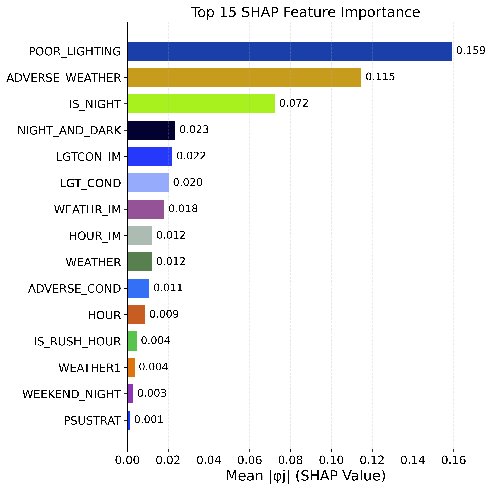

#### Mean safety scores

Safety scores by scenario category confirm that risk compounds non-linearly under adverse conditions.

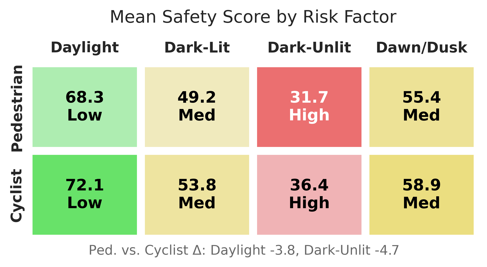

#### Key findings

- **87%** of crashes involve two or more co-occurring risk factors.
- Risk compounds non-linearly, reaching **4.5x** baseline under certain combinations.
- SHAP-ablation correlation is strong (r = 0.94).
- Estimated **22.7%** crash reduction under realistic deployment.

### 5. Application Example

The calibrated score is mapped to five operational levels for real-world deployment:

| Level | Score | Action |
|---|---|---|
| Critical | 0-20 | Emergency warning, immediate intervention |
| High | 21-40 | ADAS alert; speed advisory issued |
| Medium | 41-60 | Caution advisory, improvement suggestion |
| Low | 61-75 | Monitoring, minor corrective feedback |
| Excellent | 76-100 | Positive feedback, insurance discount eligible |

The dashboard below illustrates a driver-facing ADS interface that shows the real-time SafeDriver-IQ score, current risk factors, and contextual feedback.


### 6. Limitations

1. **Synthetic safe sample bias.** Safe samples are derived from CRSS crash records with modified environmental features. The Waymo integration provides only 500 scenarios from a single shard, limiting generalizability. VRU-specific features contribute only 0.8% to model performance because both crash and safe samples involve VRU interactions.
2. **No real-time driver behavior.** The current model assesses environmental context but not individual driving behavior such as speed limit violations, aggressive braking, or lane drift.
3. **Static feature vector.** Each prediction is treated independently, with no temporal context from the driving session.
4. **Calibration layer subjectivity.** Penalty values are grounded in safety literature but involve expert judgment. A data-driven approach using Platt scaling with fleet outcome data would reduce subjectivity.

### 7. Conclusion and Future Directions

SafeDriver-IQ addresses the limitation of binary crash prediction by inverting a trained crash classifier into a continuous 0-100 safety score. The framework provides real-time, interpretable risk feedback informed by eight years of national crash data and real-world autonomous vehicle trajectories. The primary finding demonstrates that environmental context and multi-factor compounding dominate crash risk far more than driver aggression alone, with certain factor combinations reaching 4.5x baseline risk.

Future work will:

- Expand Waymo integration to thousands of scenarios.
- Fuse live telemetry (OBD-II, GPS-derived speed, accelerometer data) to enable real-time behavioral scoring.
- Conduct field validation with fleet operators.
- Develop a prototype online learner with prioritized experience replay for incremental risk-weight updates.

More broadly, the framework establishes a reusable paradigm: any domain-specific binary risk classifier can be inverted into a proactive, explainable safety scoring system using the same pipeline, without building new models from scratch.

For full retraining:

```powershell
python retrain_model.py
```

See `PROJECT_SETUP_SUMMARY.md` for detailed setup.

### 🧾 Phase 1 Authors

- Joyjit Roy
- Samaresh Kumar Singh
- Sushanta Das
- Mojtaba Bahramgiri

### 📚 Citation
```bibtex
@article{safedriveriq,
  author  = {Roy, Joyjit and Singh, Samaresh Kumar and Das, Sushanta and Bahramgiri, Mojtaba},
  title   = {Real-Time Driver Safety Scoring Through Inverse Crash Probability Modeling},
  journal = {arXiv preprint arXiv:2603.14841},
  year    = {2026},
  doi     = {10.48550/arXiv.2603.14841},
  url     = {https://arxiv.org/abs/2603.14841},
  note    = {Presented at IEEE EIT 2026, forthcoming in IEEE Xplore}
}
```


# <span style="color:blue">Phase 2: PRISM - An Agentic Multi-Model Architecture for Proactive Safety in Autonomous Transportation Systems</span>

### Overview

PRISM (Proactive Risk Intelligence and Safety Management) is the second phase of the Vehicle_Safety_Research program. It advances the Phase 1 SafeDriver-IQ inverse crash-probability foundation from a static, national-crash-based scoring model to a dynamic, scene-aware agentic safety architecture. PRISM fuses three parallel risk models - environmental, trajectory kinematic, and VRU interaction - through a deep Q-network reinforcement-learning agent that produces graduated interventions and SHAP-based explanations. The work has been accepted for the **ASCE 2027: The Infrastructure and Engineering Experience** conference (Abstract ID ASCE2027-1804, Transportation Engineering track).

### Research Flyer

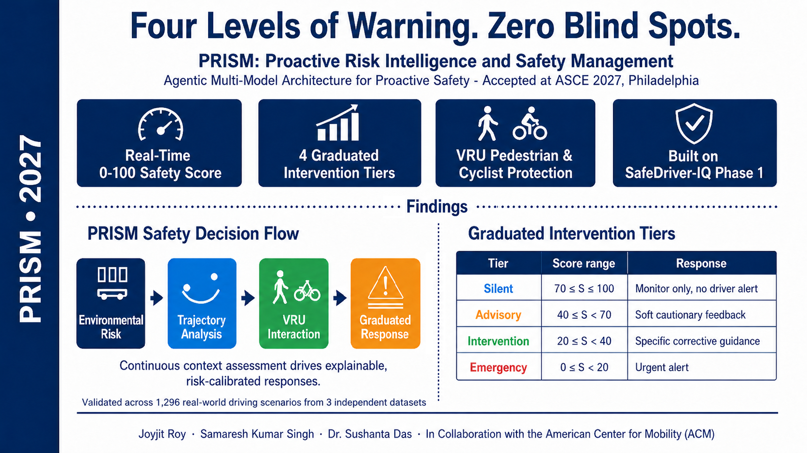

Phase 2 extends the foundation into an agentic multi-model architecture with environmental, trajectory, and VRU risk models fused by a DQN agent. PRISM was validated across nuScenes, Argoverse 2, and Waymo WOMD, achieving a mean safety score of 68/100 with 77.6% of scenarios classified as advisory.


### Abstract

Autonomous and intelligent transportation systems operate in complex urban environments where safety depends on interactions among vehicle behavior, environmental conditions, and vulnerable road users (VRUs). Most advanced driver-assistance systems (ADAS) are reactive: collision detection and emergency braking activate only after hazards have emerged. The continued rise in VRU fatalities shows that vehicle-centric, threshold-based safety strategies leave a critical gap.

This study introduces PRISM, an agentic multi-model architecture that moves from reactive crash avoidance to proactive, continuous risk management. A frozen SafeDriver-IQ random forest supplies environmental risk, while dedicated trajectory-kinematic and VRU-interaction models capture dynamic scene behavior. An agentic reasoning layer fuses these signals through reinforcement learning, contextual memory, and feature-level SHAP attribution, and outputs one of four graduated intervention tiers. Across 1,296 validation scenarios from nuScenes, Argoverse 2, and Waymo WOMD - without dataset-specific retraining - PRISM achieves a mean safety score of 68/100, classifies 77.6% of scenarios as advisory, and flags a near-miss rate of 3.8%. Feature attribution consistently identifies VRU risk and trajectory risk as the dominant safety drivers.

### 1. Introduction

Autonomous and intelligent transportation systems are increasingly deployed in dense urban areas where safety depends on continuous interaction among vehicle behavior, environmental conditions, and VRUs. Although automation can reduce crashes caused by human error, maintaining safety in mixed traffic remains a major challenge. VRU fatalities in the United States have reached record levels, revealing a persistent disconnect between vehicle-centric safety design and the realities of shared urban mobility.

Production ADAS is fundamentally reactive: automatic emergency braking and forward collision warning activate only after a hazard materializes, and rely on fixed thresholds that do not adapt to context. A maneuver treated as safe on an open highway is processed the same way as one near a crowded crosswalk at night, producing unaddressed risks in complex environments and nuisance alerts in benign ones.

An alternative treats safety as a continuous, predictive measure rather than a discrete event trigger. In our prior work, SafeDriver-IQ, we introduced an inverse crash-probability method that converts a binary crash classifier trained on national crash records into a calibrated 0-100 safety score. That study showed that environmental context and the co-occurrence of multiple risk factors, rather than driver aggression alone, dominate crash risk. However, the Phase 1 model is less responsive to dynamic, scene-level indicators of imminent VRU risk such as relative trajectories, closing speeds, and time-to-collision.

PRISM builds on that foundation with an agentic multi-model safety architecture. Three specialized models operate in parallel to assess environmental risk, trajectory kinematics, and VRU interaction. An agentic reasoning layer fuses their outputs through reinforcement learning, contextual memory, and feature-level attribution. The result is a graduated set of interventions, from silent monitoring to emergency alerts, each accompanied by an explanation of contributing factors.

### 2. System Architecture

PRISM is organized as a four-layer pipeline that converts raw multi-agent motion data into a continuous, explainable safety score with graduated intervention outputs. Figure 1 illustrates the overall design.

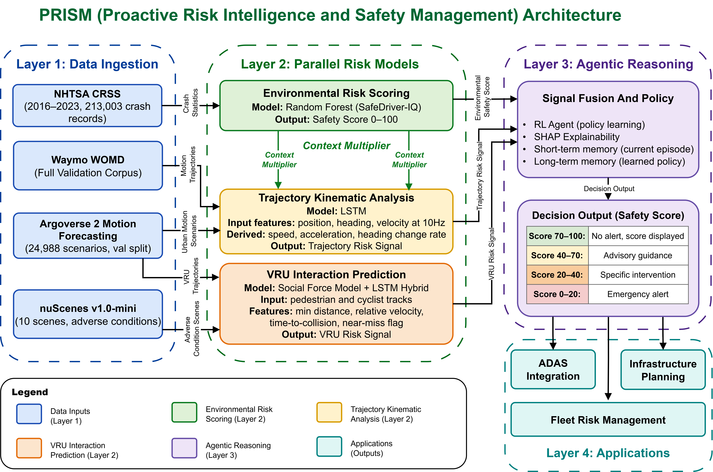

**Layer 1: Data Ingestion and Normalization**

The three source datasets use incompatible on-disk formats. The ingestion layer converts each dataset into a unified `DrivingScene` object containing `AgentTrack` records with position, velocity, heading, object type, and validity mask sampled at 10 Hz, plus scene-level night and rain flags. Agent types are normalized to vehicle, pedestrian, or cyclist, with pedestrians and cyclists grouped as VRUs. For Waymo data, where type fields are ambiguous, classification falls back to bounding-box dimensions so no track is omitted.

A parallel transformation prepares CRSS-style metadata for the environmental model. This ensures the frozen Phase 1 random forest receives inputs in its original feature space, eliminating retraining. The two-track normalization lets all three Layer 2 models share a single ingestion pass over the raw data.

**Layer 2: Parallel Risk Models**

- **Environmental Risk Scoring.** The environmental model reuses the frozen SafeDriver-IQ random forest as a context estimator. It produces an inverse-crash safety score `S_env` in [0, 100], which is converted to a normalized environmental risk `r_env = clip((100 - S_env) / 100, 0, 1)` and then into a context multiplier `m = 0.5 + r_env`. A benign environment damps dynamic risk (`m < 1`), while a hostile one such as night or rain amplifies it (`m > 1`). The environmental model therefore acts as a multiplier rather than an equal vote, directly addressing the inability of the standalone Phase 1 model to respond to dynamic context.

- **Trajectory Kinematic Analysis.** The trajectory model evaluates each agent's motion quality by computing speed, longitudinal and lateral acceleration, and yaw rate from smoothed finite differences. Per-timestep kinematic risk is derived from normalized exceedances of comfort and aggression thresholds for hard braking, hard acceleration, swerving, and speeding. Track-level risk reflects the aggregated exceedance over the agent's trajectory, and the scene-level trajectory risk is the maximum across all agents.

- **VRU Interaction Prediction.** The VRU model estimates ego-VRU conflict risk using a Social Force Model for reaction-aware rollout combined with a recurrent Social-LSTM-style predictor. For each ego-VRU pair it calculates closest approach distance and a time-to-collision proxy, combining these into an interaction risk `r_vru` in [0, 1]. A near-miss is flagged when minimum distance drops below 2.0 m for pedestrians or 1.5 m for cyclists.

- **Risk Fusion.** The three signals are fused into a single dynamic risk. Trajectory and VRU risks are first blended with VRU-dominant weights `w_t = 0.5` and `w_v = 1.0`, reflecting that VRU conflicts are the safety-critical case:

```
r_base = (w_t * r_traj + w_v * r_vru) / (w_t + w_v)
r_fused = clip(m * r_base, 0, 1)
S = 100 * (1 - r_fused)
```

These equations define the PRISM heuristic baseline; the RL agent in Layer 3 learns the final intervention policy on top of the same state.

**Layer 3: Agentic Reasoning**

The reasoning layer encodes each scenario as a fixed eight-dimensional state vector comprising environmental risk, environmental multiplier, trajectory risk, VRU risk, normalized proximity and imminence surrogates, and night and rain flags. A deep Q-network maps this state to one of four intervention tiers by selecting the action with the highest estimated value. Learning the policy, rather than thresholding the heuristic score, lets the system weigh combinations of risk factors that fixed rules treat independently.

Each decision includes SHAP attribution across the eight state features, highlighting the factors influencing the selected tier. Short-term memory maintains the current episode for temporal consistency, while long-term memory stores representative past states, enabling the agent to recall similar situations and outcomes and provide a human-readable rationale for each intervention.

**Layer 4: Applications**

The graduated output supports three application domains without retraining. In ADAS integration, the tier sets driver feedback intensity. For fleet risk management, continuous scores are aggregated into route and driver risk profiles. In infrastructure planning, locations with consistently low scores identify high-conflict sites.

**Graduated Intervention Design**

PRISM emits one of four tiers based on the safety score `S`:

| Tier | Score Range | Response |
|------|-------------|----------|
| Silent | 70 <= S <= 100 | Monitor only, no driver alert |
| Advisory | 40 <= S < 70 | Soft cautionary feedback |
| Intervention | 20 <= S < 40 | Specific corrective guidance |
| Emergency | 0 <= S < 20 | Urgent alert |

### 3. Dataset Summary

PRISM was evaluated on three motion datasets without dataset-specific retraining. Table 3 summarizes the data sources.

| Dataset | Role | Scale | Hz | Conditions |
|---------|------|-------|----|------------|
| NHTSA CRSS 2016-2023 | Environmental model training | 213,003 records | - | All U.S. crash types |
| nuScenes v1.0-mini | Phase 2 validation | 10 scenes | 2 | Night, rain |
| Argoverse 2 val split | Phase 2 validation | 24,988 scenarios (1,000 sampled) | 10 | 6 U.S. cities |
| Waymo WOMD (1 shard) | Phase 2 validation | 286 scenarios | 10 | Mixed urban |

Evaluation reports the mean safety score, tier distribution (silent, advisory, intervention, emergency), near-miss rate, and SHAP feature attribution across all datasets. Cross-dataset consistency is assessed by comparing tier distributions and top-ranked SHAP features without dataset-specific adjustment.

### 4. Results and Discussion

PRISM was evaluated on 1,296 scenarios across nuScenes v1.0-mini (10 scenes), Argoverse 2 Motion Forecasting (1,000 scenarios), and Waymo Open Motion Dataset (286 scenarios). No dataset-specific retraining was conducted. Table 4 summarizes the key performance metrics.

| Dataset | n | Mean Score | Advisory % | Emergency % | Near-Miss Rate |
|---------|---|-----------:|-----------:|------------:|---------------:|
| nuScenes | 10 | 59.8 | 70.0 | 20.0 | 10.0% |
| Argoverse 2 | 1,000 | 68.6 | 76.7 | 4.6 | 7.3% |
| Waymo WOMD | 286 | 68.0 | 77.6 | 4.5 | 3.8% |

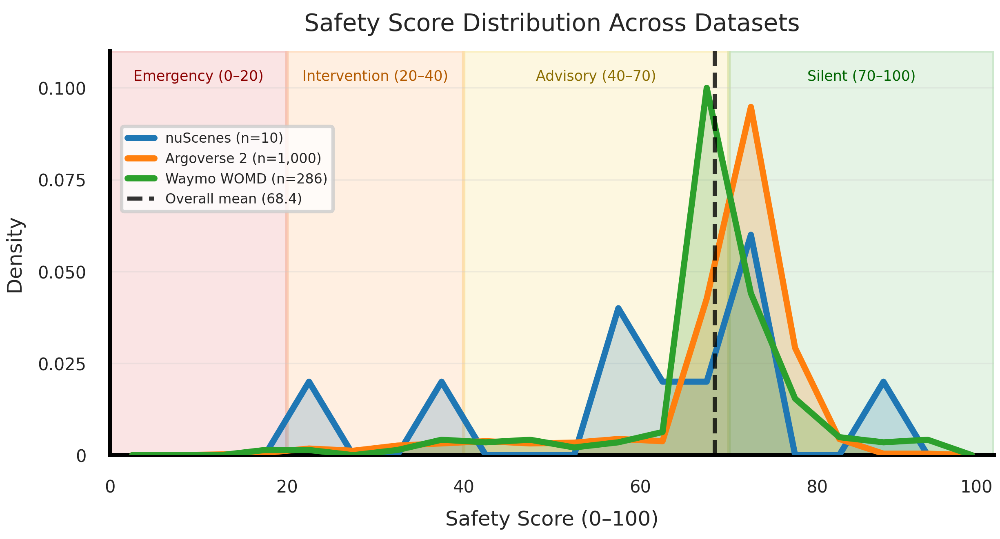

**Safety Score Distribution.** Figure 2 shows the safety score distributions across all three datasets. Argoverse 2 and Waymo converge to nearly identical means (68.6 and 68.0) despite independent data collection, sensors, and geography, demonstrating cross-domain generalization without retraining. Both distributions are advisory-dominant (40-70), consistent with structured urban driving under normal conditions. nuScenes scores are lower (mean 59.8) and shift toward the intervention and emergency bands because its scenes were explicitly sampled under adverse conditions.

**Geographic Generalizability.** Table 5 summarizes PRISM performance across six U.S. cities in Argoverse 2. Mean safety scores vary within a narrow 5.3-point range (66.4-71.7), confirming generalization across diverse traffic environments without city-specific retraining.

| City | n | Mean Score | Emergency % |
|------|---|-----------:|------------:|
| Miami | 260 | 66.4 | 7.3% |
| Washington D.C. | 124 | 68.3 | 5.6% |
| Austin | 229 | 70.4 | 3.5% |
| Dearborn | 122 | 71.2 | 0.8% |
| Pittsburgh | 205 | 67.3 | 5.4% |
| Palo Alto | 60 | 71.7 | 0.0% |

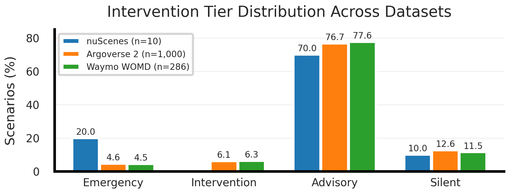

**Intervention Tier Analysis.** The advisory tier is consistently dominant: 70% on nuScenes, 76.7% on Argoverse 2, and 77.6% on Waymo. The emergency tier represents 20% of nuScenes scenes versus 4.6% in Argoverse 2 and 4.5% in Waymo, reflecting the adverse-condition sampling bias in nuScenes rather than model miscalibration. The intervention tier (6.1% Argoverse 2, 6.3% Waymo) and silent tier (12.6% Argoverse 2, 11.5% Waymo) are well-matched across the two large datasets, reinforcing calibration consistency across all four tiers.

**VRU Proximity and Near-Miss Detection.** PRISM detects VRU near-miss events by applying the Social Force Model with a conservative collision-course threshold. Across nuScenes, only scene-0061 triggered a confirmed near-miss, involving 60 pedestrians at a minimum ego-VRU distance of 2.4 m, resulting in a VRU risk of 0.72 and an emergency-tier classification. On Waymo, 11 of 286 scenarios (3.8%) triggered near-miss detections, with a mean VRU risk of 0.063, reflecting lower pedestrian density. Figure 4 shows the cumulative ego-VRU proximity distribution for Argoverse 2: 18.5% of VRU-present scenarios had a minimum distance below 5 m, all classified as intervention or emergency tier.

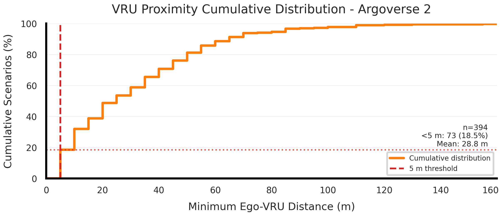

**Adverse Condition Sensitivity.** nuScenes is the only dataset with labeled adverse conditions. Night conditions increase the environmental multiplier from 0.97 to 1.33, lowering mean safety scores by 10.5 points compared with clear daytime. In the night-and-rain scene (scene-1094), the score drops to 23.3 due to a multiplier of 1.35 combined with 55 pedestrians at 3.1 m, placing the scene firmly in the emergency tier. The clear daytime emergency scene (scene-0061) shows that emergency classification can result solely from high VRU density, while the only silent-tier scene (score 85.6) had low VRU density and clear conditions, confirming PRISM does not over-escalate in genuinely safe situations.

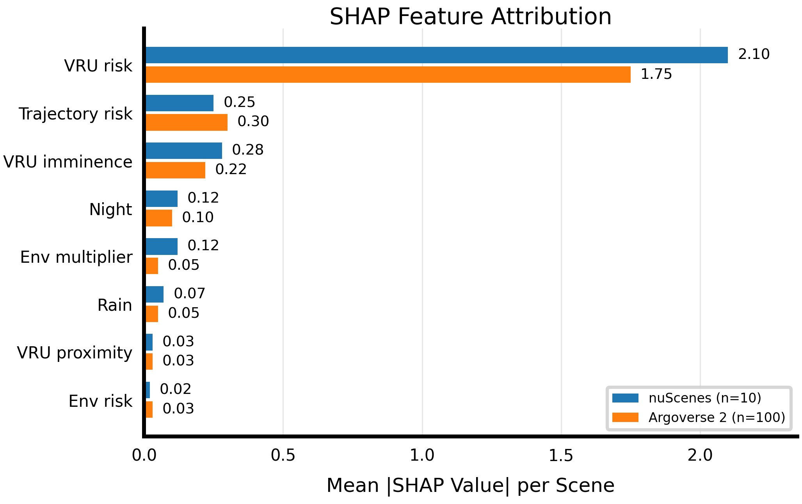

**SHAP Feature Attribution.** Figure 5 presents the top SHAP feature attributions for the PRISM RL agent. On nuScenes, VRU risk is the primary driver (mean |SHAP| = 2.10 per scene), followed by VRU imminence (0.28) and trajectory risk (0.25). On Argoverse 2, VRU risk remains dominant (1.75 per scene), with trajectory risk (0.30) ranking second and VRU imminence third (0.22). Environmental features follow the same secondary pattern. The ranking is consistent across independently collected datasets without retraining.

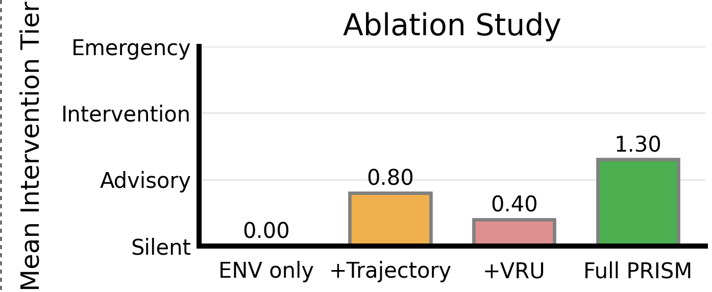

**Ablation Study.** Figure 6 presents the marginal contribution of each model component on nuScenes. With only the Phase 1 environmental model, all ten scenes are classified as silent, confirming that the RF bridge accurately captures environmental context but does not respond to dynamic trajectory or VRU signals. Including the trajectory model escalates 8 of 10 scenes to advisory. Adding the VRU model independently escalates the two highest-proximity scenes to intervention. Neither component alone reaches the emergency tier. The full PRISM system, with the RL agent synthesizing all three signals, correctly classifies both scenes as emergencies and maintains advisory for the remaining seven kinematically active scenes.

**Tier Boundary Sensitivity.** To assess robustness, each composite-score boundary was adjusted by +/-5 points and tier distributions were recalculated for all 1,000 Argoverse 2 scenarios. The combined emergency and intervention escalation rate varied from 8.8% (shift -5) to 12.6% (shift +5), a range of less than 4 percentage points, confirming that safety-critical tier assignments are robust to minor calibration errors.

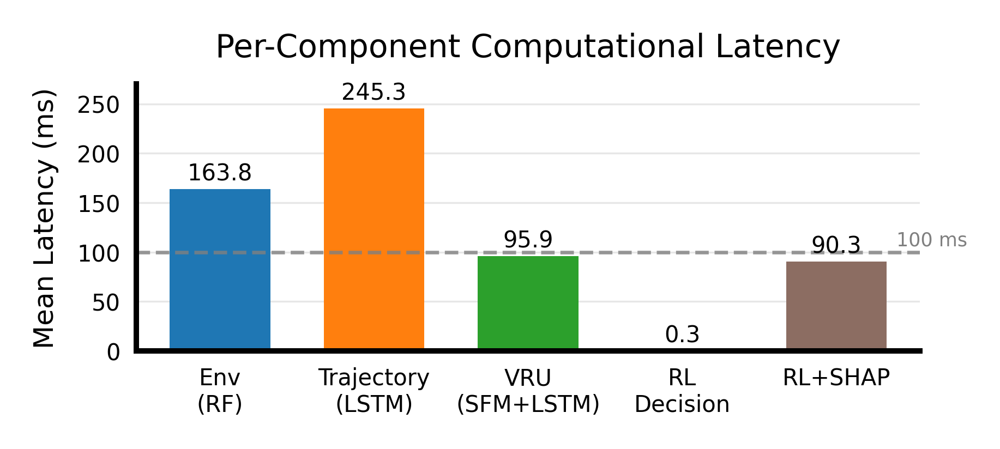

**Computational Latency.** Figure 7 profiles per-component mean latency on CPU. The trajectory LSTM is the dominant cost at 245.3 ms, followed by the environmental RF bridge at 163.8 ms, the VRU module (SFM + LSTM) at 95.9 ms, and SHAP attribution at 90.3 ms. The RL decision step itself is negligible at 0.3 ms. Total end-to-end latency is approximately 596 ms on CPU, consistent with an offline post-processing role rather than hard real-time control.

**Risk Factor Co-occurrence.** Both emergency-tier scenes in nuScenes involve two or more risk dimensions occurring simultaneously: scene-0061 (confirmed VRU near-miss and high trajectory risk) and scene-1094 (VRU near-miss, high trajectory risk, and adverse night/rain conditions). Scenes with only a single elevated risk dimension remained at the advisory tier, consistent with Phase 1 findings that compound risk factors lead to the most severe outcomes. The RL agent's ability to synthesize signals across three independent model streams is what enables detection of these compound events, which no single model alone would escalate to an emergency.

### 5. Application Examples

The graduated PRISM output supports three application domains without retraining. The mockups below show how the safety score and tier can be surfaced to drivers, fleet operators, and infrastructure planners.

**ADAS Integration.** The tier sets driver feedback intensity in the vehicle. In safe conditions the system remains silent; as risk increases it escalates through advisory, intervention, and emergency alerts, each with a SHAP-based explanation of the dominant factors.


**Fleet Risk Management.** Continuous scores are aggregated across trips to identify dangerous routes, peak risk periods, and unsafe driving patterns without requiring an actual crash. The same signal supports driver coaching and proactive maintenance.


**Infrastructure Planning.** Locations with consistently low safety scores identify high-conflict sites. Planners can use these metrics to guide crosswalk placement, signal timing, and school zone protections, with explicit attention to VRU safety.

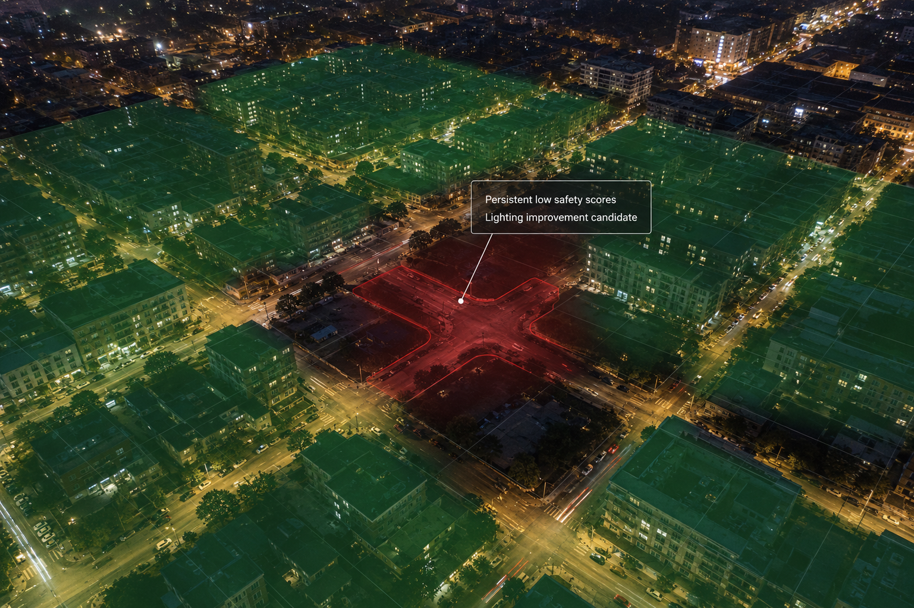

### 6. Limitations

PRISM's evaluation has several limitations. The nuScenes subset comprises only ten scenes, which limits the statistical power of conclusions about adverse conditions. None of the datasets include annotated near-miss ground truth, so VRU detection is reported as a detection rate against a threshold-based proxy rather than precision and recall against labeled events. The intervention tier boundaries are derived from domain knowledge rather than learned from labeled intervention data, and their optimality has not been independently validated. The RL agent was trained exclusively on nuScenes; while cross-dataset tier consistency is encouraging, it does not guarantee formal generalization. Finally, the end-to-end latency of approximately 596 ms on CPU prevents hard real-time deployment; GPU or ONNX-optimized inference is required for on-vehicle integration.

### 7. Conclusion and Future Directions

PRISM advances the Phase 1 SafeDriver-IQ foundation from static crash-probability scoring to dynamic, scene-aware intervention decisions. By fusing environmental, trajectory-kinematic, and VRU-interaction risk models through a DQN reinforcement-learning agent with SHAP explainability, the architecture provides a unified, interpretable, and dataset-agnostic proactive safety assessment. Across 1,296 scenarios from nuScenes, Argoverse 2, and Waymo WOMD without retraining, PRISM achieved a mean safety score of 68/100, classified 77.6% of scenarios as advisory, and flagged a near-miss rate of 3.8%. SHAP attribution confirmed VRU risk as the primary decision driver, and all emergency-tier classifications involved two or more active risk dimensions.

Immediate future work targets latency optimization through GPU deployment and ONNX-optimized inference, with the trajectory LSTM and environmental RF bridge as the main compression targets. Data-driven tier calibration using labeled intervention logs would replace fixed thresholds and improve sensitivity near tier boundaries. Extending RL training to Argoverse 2 and Waymo would provide a formal generalization guarantee beyond the observed cross-dataset consistency. Collaborating with fleet operators or simulation environments to obtain annotated near-miss labels would enable precision-recall evaluation of the VRU detector. Finally, vehicle-to-infrastructure (V2X) signals and federated learning extensions would extend PRISM beyond ego-vehicle perception while keeping sensitive trip data decentralized.

### Phase 2 Authors

- Joyjit Roy
- Samaresh Kumar Singh
- Sushanta Das


# <span style="color:blue">Phase 3: PRISM-AR - Explainable Risk-Adaptive Driving Intelligence for Vulnerable Road User Communication in Automated Vehicles</span>

### Overview

PRISM-AR (PRISM with Augmented Reality) is the third phase of the Vehicle_Safety_Research program. It extends the internal risk reasoning of PRISM into an external, VRU-facing communication layer for automated vehicles (AVs). While Phase 2 produces a continuous safety score and intervention tier for the vehicle, PRISM-AR maps those same risk states to adaptive augmented-reality cues for pedestrians and cyclists. The framework is designed for the IEEE Transactions on Vehicular Technology (TVT) special issue on Advanced Driving Intelligence for Autonomous Vehicles.

### Research Flyer

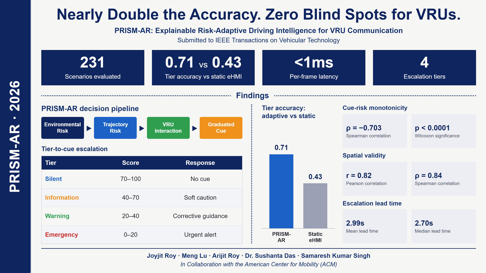

Phase 3 maps PRISM's fused risk state to risk-adaptive AR cues for pedestrians and cyclists. It was evaluated on 231 scenario clips across three public AV datasets plus synthetic near-miss cases, improving proxy tier accuracy from 0.43 (static eHMI) to 0.71 (PRISM-AR) and achieving Spearman cue-risk monotonicity ρ = -0.703.


### Abstract

Automated vehicles must assess risk internally and communicate safety-relevant intent to vulnerable road users (VRUs) in real time. Existing external human-machine interface (eHMI) designs rely on static, predefined signals that do not adapt to the vehicle's internal safety state, limiting their ability to reflect dynamic risks from the environment, trajectory, and VRU interactions.

PRISM-AR addresses this gap by extending the Proactive Risk Intelligence and Safety Management (PRISM) framework from internal AV risk reasoning to external VRU-facing communication. It builds on the inverse crash-probability safety-scoring foundation of SafeDriver-IQ and the multi-model risk engine of PRISM, integrating environmental, trajectory, and VRU-interaction risk streams. A transparent reference decision layer performs fused risk scoring and tier selection, while a tiered external communication policy maps risk states to adaptive cues for pedestrians and cyclists across four escalation levels: silent, information, warning, and emergency.

PRISM-AR was evaluated on 231 scenario clips from three public AV datasets and controlled near-miss scenarios, with paired comparisons against no-interface, static eHMI, and oracle upper-bound policies. Compared with a static eHMI baseline, PRISM-AR improves proxy ground-truth tier accuracy from 0.43 to 0.71, activates warning and emergency cues in risk-critical cases where the static baseline does not escalate, and achieves strong monotonic alignment between cue intensity and risk severity (Spearman rho = -0.703, Wilcoxon p < 0.0001). The reference implementation runs the complete per-frame pipeline at sub-millisecond latency, supporting integration into real-time AV decision architectures.

### 1. Introduction

Global road traffic fatalities remain a persistent public health challenge. The World Health Organization estimates 1.19 million annual deaths from road traffic crashes, with pedestrians, cyclists, and motorcyclists representing more than half of global road traffic deaths. In the United States, NHTSA reported over 39,000 traffic fatalities in 2024, and pedestrian deaths continue to rise despite advances in vehicle safety technology.

As automated vehicles operate alongside VRUs in urban environments, a key safety challenge emerges: non-motorized road users must infer vehicle intent from limited and often ambiguous visual cues, without access to the AV's internal risk state. The present work focuses on pedestrians and cyclists, the VRU categories annotated in the datasets used. Addressing this perceptual gap requires more than vehicle kinematics; it requires an active, context-aware external communication channel.

External human-machine interface (eHMI) systems have been proposed to bridge this gap by projecting visual signals onto the vehicle exterior, surrounding road surface, or wearable displays. These systems signal yielding or stopping intent and can reduce pedestrian hesitation at crossing scenarios. However, most current eHMI designs use predefined, rule-based signal states that do not adapt to changing scene context. They communicate discrete intent states, such as stopping or proceeding, but do not convey information about risk magnitude, closing distance, trajectory conflict, adverse lighting, or road conditions. As a result, a vehicle may display the same signal in clear daylight as in rain or low visibility, despite very different underlying risk.

This limitation highlights a structural gap: AV internal risk reasoning and external VRU communication have largely developed in isolation. PRISM-AR integrates explainable, multi-model risk intelligence with an external communication layer in a unified pipeline, allowing the AV's internal risk state to directly drive adaptive, graduated external cues.

### 2. System Architecture

PRISM-AR is the third stage in the SafeDriver-IQ, PRISM, and PRISM-AR sequence. SafeDriver-IQ's Random Forest model, trained on 213,003 NHTSA CRSS records, provides the inherited 0-100 safety score. PRISM adds the dynamic multi-model risk engine. PRISM-AR adds the augmented reality external communication layer, supporting HMD overlays, projected road cues, and pedestrian-facing vehicle displays. Figure 1 shows the complete system architecture.


**Data Ingestion and Scene Abstraction.** The system operates on a unified `DrivingScene` abstraction that standardizes heterogeneous AV dataset formats into a common representation consumed by all downstream risk modules. Each scene includes an identifier, dataset origin, an agent dictionary with the ego vehicle and detected traffic participants, and scene-level attributes including weather condition, ambient lighting state, road surface condition, time of day, speed limit, and location. Agents are represented by per-frame two-dimensional position and velocity arrays sampled at 10 Hz. VRUs are defined as agents classified as pedestrians or cyclists.

This abstraction decouples the risk engine from dataset-specific formats and enables consistent evaluation across multiple AV data sources without modifying the risk computation pipeline. NHTSA CRSS records are not treated as time-series AV scenes; instead, CRSS provides the crash-statistical foundation for the environmental risk bridge inherited from SafeDriver-IQ. Waymo, Argoverse 2, and nuScenes provide scene-level AV data that are converted into the `DrivingScene` representation and passed to the trajectory, VRU-interaction, and tier-assignment modules.

**Multi-Model Risk Engine.** The PRISM risk engine processes each `DrivingScene` through three parallel modules that assess environmental, kinematic, and VRU-interaction risk dimensions. All three modules operate on the unified scene representation and produce risk estimates on a common [0, 1] scale. The trajectory and VRU-interaction modules use transparent, closed-form analytic risk functions to ensure reproducible cross-dataset evaluation, while the environmental risk module uses a trained model bridge.

- **Environmental Risk Module.** Estimates the impact of scene context on overall driving risk. It converts weather, ambient lighting, road surface, time of day, and VRU density into a normalized scalar risk value `r_env` in [0, 1]. In the evaluated implementation, `r_env` is generated by blending a trained scene-context model with the SafeDriver-IQ CRSS-derived estimate: `r_env = 0.95 * r_model + 0.05 * r_crss`. A simplified discrete rule-based mapping is available as a fallback for environments without the trained bridge.

- **Trajectory Risk Module.** Generates a per-frame risk array `r_traj(t)` based on time-to-collision (TTC) and closing motion between the ego vehicle and nearby VRUs. Relative speed is incorporated as the primary driver of TTC. Risk is assigned using a saturating TTC function: 0.99 when TTC < 1.0 s, 0.95 * exp(-(TTC-1.0)/0.7) for 1.0 <= TTC < 2.0 s, and exp(-TTC/2.0) otherwise.

- **VRU Interaction Risk Module.** Generates a per-frame interaction risk `r_vru(t)` from the closest pedestrian or cyclist relative to the ego vehicle, using minimum Euclidean distance `d_min(t)`: 0.99 when d_min < 2 m, 0.95 * exp(-(d_min-2.0)/1.5) for 2 <= d_min < 4 m, and exp(-d_min/4.0) otherwise.

**Risk Fusion and Tier Selection.** The three normalized risk outputs are combined into a single fused risk value using deterministic weighted fusion:

```
r_fused(t) = clip[0,1] (w_env * r_env + w_traj * r_traj(t) + w_vru * r_vru(t))
S(t) = 100 * (1 - r_fused(t))
```

The weights used for all reported results are `w_env = 0.40`, `w_traj = 0.30`, and `w_vru = 0.30`, giving environmental context, kinematic trajectory risk, and VRU-interaction risk comparable influence. The score `S(t)` is mapped to one of four communication tiers:

| Tier | Score Range | Cue Intensity | Message |
|------|-------------|---------------|---------|
| Silent | 70 <= S(t) <= 100 | None | - |
| Information | 40 <= S(t) < 70 | 0.35 opacity, no flash | Caution |
| Warning | 20 <= S(t) < 40 | 0.65 opacity, no flash | Do not cross |
| Emergency | 0 <= S(t) < 20 | 0.90 opacity, flashing | STOP |

The architecture supports an agentic extension where fixed-weight fusion and threshold-based tier selection are replaced by a learned decision policy. In this extension, a deep Q-network policy selects among the four communication tiers using a state vector that includes the safety score, component risk magnitudes, dominant risk factor, and short-term tier history. SHAP attribution provides frame-level explanations, and a short-term memory buffer helps reduce unstable tier transitions. These features are part of the broader PRISM design lineage but are not evaluated in the PRISM-AR reference implementation presented here.

**External VRU Communication Policy.** The external VRU communication policy maps each per-frame tier to a structured cue specification. Opacity increases with each tier, and flashing is reserved for the emergency tier to maximize salience while limiting habituation at lower risk levels. The policy uses a deterministic lookup table indexed by the tier label, ensuring each external cue is directly traceable to the internally computed safety score. Cues can be delivered through three VRU-facing channels:

| Channel | Cue Realization | Key Considerations |
|---------|-----------------|--------------------|
| HMD overlay | AR cue rendered in the VRU's field of view | Personalized guidance, but requires wearable-device adoption, localization, and vehicle-to-device communication. |
| Projected cue | Light projection onto the road, crosswalk, or pedestrian zone | Spatially intuitive and visible to nearby VRUs, but sensitive to lighting, weather, road surface, and occlusion. |
| Pedestrian-facing vehicle display | LED panel, light band, or exterior vehicle screen | Vehicle-integrated and deployment-friendly, but limited by viewing angle, distance, and cue-standardization needs. |

The complete risk-to-cue inference pipeline ingests the `DrivingScene`, computes environmental, trajectory, and VRU risks, fuses them, selects a tier, determines the dominant factor, maps the tier to a cue, and delivers it to the active VRU-facing channel.

### 3. Dataset Summary

The PRISM-AR evaluation uses public automated-driving datasets and a controlled near-miss supplement to assess adaptive VRU-facing cue generation. All experiments use the reference implementation described in the architecture section.

| Dataset | Candidate Clips | Evaluated Clips | Source |
|---------|----------------:|----------------:|--------|
| Waymo WOMD | 286 | 25 | Public AV validation data |
| Argoverse 2 | 1,000 | 50 | Public AV validation data |
| nuScenes v1.0-mini | 10 | 96 | Public AV validation data |
| Synthetic near-miss | - | 60 | Controlled simulation scenarios |
| **Total** | **1,296** | **231** | |

NHTSA CRSS records are excluded as time-series AV scenes; they serve as the crash-statistical foundation for the environmental risk bridge.

**Scenario Extraction.** Scenarios are extracted using a consistent VRU-interaction filter: a clip is retained if at least one pedestrian or cyclist enters a 20 m ego-approach radius, the ego-VRU distance decreases over a continuous window, and the VRU remains visible for at least five frames. Retained clips are normalized to the `DrivingScene` representation and limited to 3-10 s (30-100 frames at 10 Hz). Multiple candidate windows favor clips with adverse lighting, weather, or road-surface conditions.

A controlled near-miss generator supplements the dataset-derived clips with pedestrian-crossing scenarios parameterized by weather, lighting, road condition, ego speed, and pedestrian behavior. These synthetic scenes include warning and emergency situations, which are uncommon in public AV datasets.

**Tier Rules and Evaluation Metrics.** Proxy ground-truth tier labels are derived from fixed distance and time-to-collision thresholds:

| Tier | Score Rule | Proxy Ground-Truth Rule |
|------|------------|-------------------------|
| Silent | 70 <= S(t) <= 100 | Otherwise |
| Information | 40 <= S(t) < 70 | Distance < 5 m or TTC < 2.5 s |
| Warning | 20 <= S(t) < 40 | Distance < 2 m or TTC < 1.0 s |
| Emergency | 0 <= S(t) < 20 | Distance < 1 m or TTC < 0.5 s |

When multiple ground-truth rules are satisfied, the highest-severity tier is assigned. Key metrics include tier accuracy, warning recall, emergency recall, cue-risk monotonicity, escalation lead time, cue flicker, and visual clutter.

Three baseline policies are evaluated alongside PRISM-AR: no-AR (no external cue), static AR (fixed information-level cue regardless of risk), and oracle (tiers assigned directly from ground-truth distance and TTC thresholds).

### 4. Results and Discussion

The PRISM-AR evaluation pipeline is summarized in Figure 2.

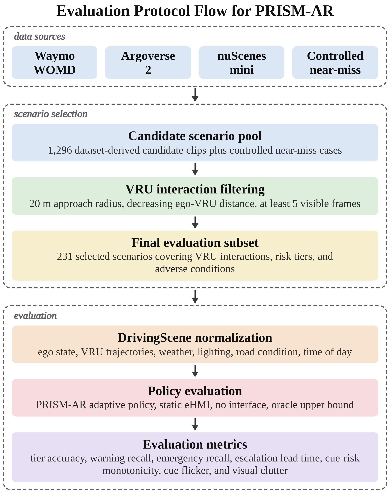

**Aggregate Risk and Tier Distribution.** The overall mean safety score across 231 evaluated scenarios is 61.2 out of 100, with a standard deviation of 11.0. Dataset-derived clips average 66.2, while the controlled near-miss subset averages 47.1, confirming that the synthetic supplement broadens coverage of lower-score, higher-risk cases. The score distribution spans 40.2-81.8. Waymo and Argoverse 2 scenarios straddle the information-silent boundary (median 70.2 and 65.6), while nuScenes clips are more widely distributed within the information range. Synthetic near-miss scenarios fall within the 40-55 band.

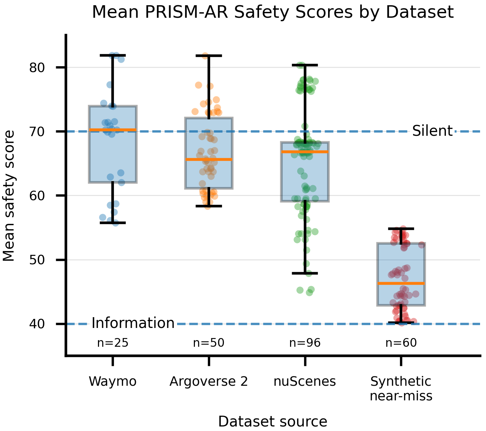

PRISM-AR assigned tiers and proxy ground-truth tiers are shown in Figures 3 and 4. Information and silent tiers dominate dataset-derived clips, while warning frames appear mainly in the synthetic subset, with smaller contributions from nuScenes and Waymo. Emergency assignments are almost entirely synthetic, confirming that the controlled near-miss scenarios provide the high-risk cases needed to assess escalated-tier recall. Compared with assigned tiers, ground-truth labels include more warning and emergency frames, indicating that the reference implementation is conservative in assigning escalated tiers.

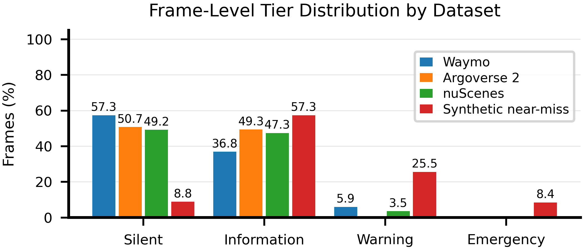

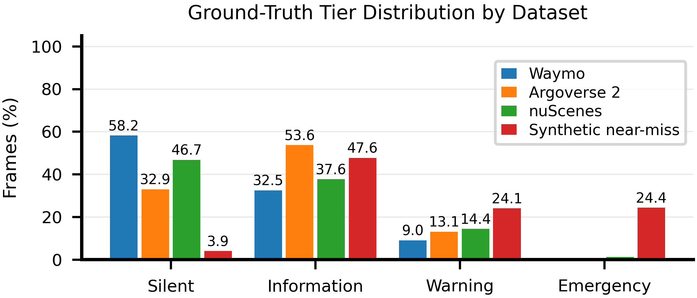

**Tier Accuracy and High-Risk Recall.** PRISM-AR achieves a mean tier accuracy of 70.9% across 231 scenarios, compared to 42.6% for the static baseline, yielding a 28.3-point improvement from risk-adaptive tier selection. Across datasets, adaptive tier accuracy ranges from 60.7% on the synthetic near-miss subset to 84.3% on Waymo, with nuScenes and Argoverse 2 at 74.6% and 69.2%, respectively. The static baseline emits a fixed information-level cue, resulting in zero warning and emergency recall by construction. PRISM-AR recovers 19.6% of warning frames and 9.1% of emergency frames on average across all scenarios. In the synthetic near-miss subset, it recovers 46.2% of warning frames and 35.1% of emergency frames.

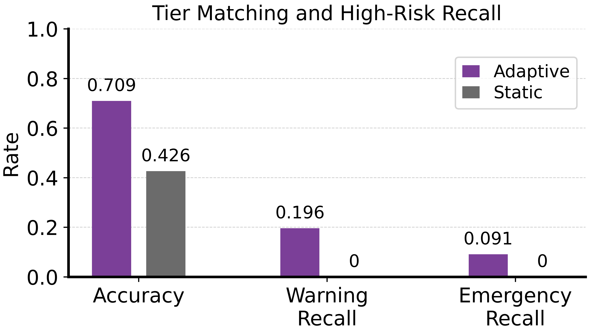

**Escalation Lead Time.** Timely warning delivery is essential for a proactive safety interface. Of 231 scenarios evaluated, 86 generated a warning with measurable lead time. In these warned scenarios, the mean lead time is 2.99 s and the median is 2.70 s, with values ranging from 1.0 s to 9.5 s. The synthetic near-miss subset is capped at 3.0 s by design, with a mean of 2.38 s. Dataset-derived subsets exhibit longer lead times when warnings occur: nuScenes averages 4.55 s across 18 warned scenarios and Waymo averages 4.00 s across 8 warned scenarios. A mean lead time near 3 s indicates that when PRISM-AR escalates, it usually provides an actionable warning window.

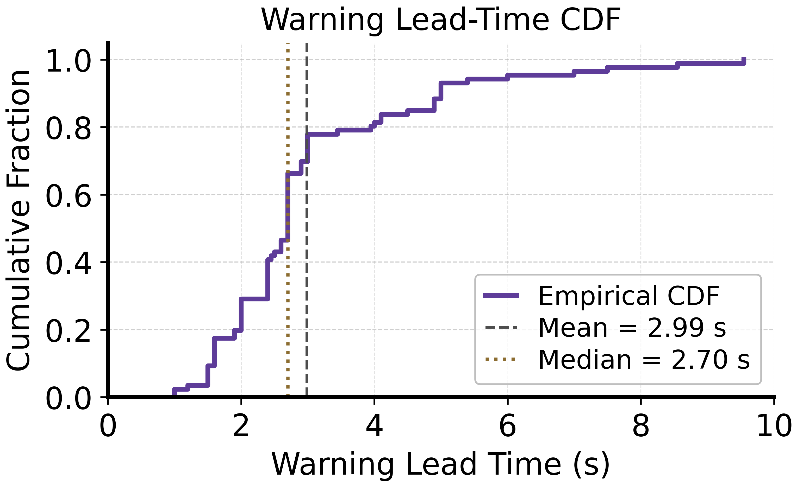

**Spatial Validity of the Safety Score.** To enable effective cue selection, the safety score must reflect the spatial severity of ego-VRU interactions. Figure 7 plots the mean per-scenario PRISM-AR safety score against the minimum ego-VRU distance. These measures are strongly correlated, with a Pearson correlation of 0.82 and a Spearman rank correlation of 0.84 across all 231 scenarios (p < 10^-56). Scenarios with closer ego-VRU approaches consistently receive lower safety scores, confirming that the fused score captures proximity-driven risk.

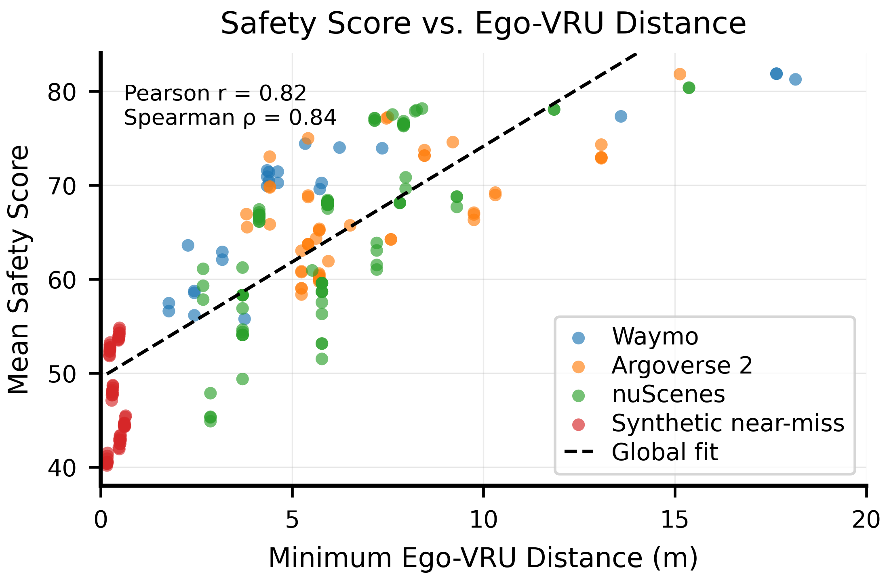

**Cue Stability and Visual Load.** Beyond tier correctness, a VRU-facing interface must avoid unstable or visually cluttered cue behavior. Cue flicker is measured as the frequency of tier transitions per second, averaging 0.66 Hz across all scenarios, with dataset-level means below 1.2 Hz across all subsets. Waymo and the synthetic near-miss subset exhibit the highest mean flicker rates (1.16 Hz and 1.09 Hz), reflecting more dynamic interactions. Visual clutter, defined as the mean AR overlay opacity across all frames in a scenario, averages 0.25 across all scenarios, with dataset-derived subsets below 0.19 and the synthetic near-miss subset at 0.44. The graduated tier policy maintains a sparse visual channel under typical conditions and increases visual load only when higher risk is present.

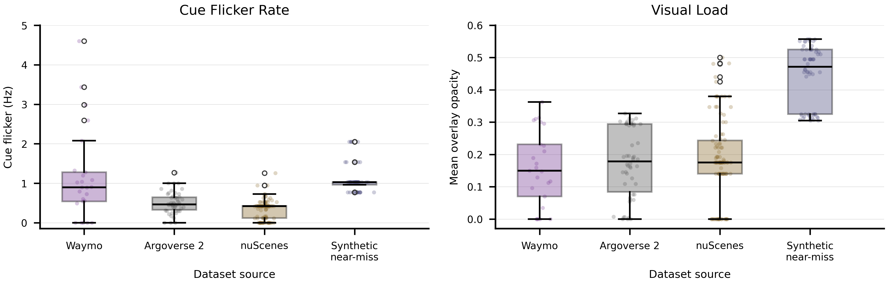

**Policy Comparison, Cue-Risk Monotonicity, and Runtime.** Table VIII summarizes the policy-level comparison. The no-interface baseline has zero recall. The static eHMI baseline has 42.6% tier accuracy and zero escalated-tier recall. PRISM-AR achieves 70.9% tier accuracy, 19.6% warning recall, and 9.1% emergency recall. The oracle upper bound is 100% on all metrics.

| Policy | Tier Accuracy | Warning Recall | Emergency Recall |
|--------|---------------|----------------|------------------|
| No interface | N/A | 0.0% | 0.0% |
| Static eHMI | 42.6% | 0.0% | 0.0% |
| PRISM-AR | 70.9% | 19.6% | 9.1% |
| Oracle upper bound | 100.0% | 100.0% | 100.0% |

Cue-risk monotonicity, assessed by comparing cue opacity with the fused safety score, shows a strong negative relationship (Spearman rho = -0.703, Wilcoxon p < 0.0001), indicating that cue intensity increases as the inferred safety score decreases. The per-frame reference pipeline runs at sub-millisecond latency, supporting integration with real-time AV decision architectures.

**Ablation Study.** To quantify each risk model's contribution, the reference implementation was re-evaluated on a 151-scenario subset under four conditions: the full system and three ablations that individually remove the trajectory, environmental risk, or VRU interaction model. Removing the trajectory model increases the mean score to 65.8, but warning recall drops from 17.4% to 0.1% and tier accuracy falls from 71.6% to 46.7%, confirming that kinematic risk primarily drives escalated tier selection. Removing the environmental risk model causes a smaller decline: tier accuracy decreases to 67.4% and warning recall to 0.8%, showing that environmental context helps determine when kinematic risk should trigger an external warning. Removing the VRU interaction model produces the opposite failure mode: the mean score drops to 52.5, warning recall rises sharply to 78.8%, and the static baseline's under-warning rate reaches 79.5%, more than double the full-system value of 31.8%. Without VRU-model gating, trajectory risk escalates indiscriminately. The full system balances sensitivity and specificity.

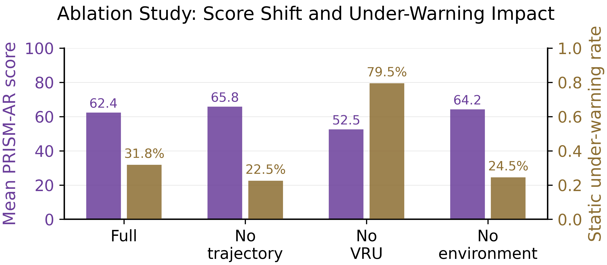

### 5. Application Examples

PRISM-AR links the internal AV risk assessment to external safety cues delivered through three channels: an HMD overlay, a projected road cue, and a pedestrian-facing vehicle display. These deployment examples are conceptual and have not been validated in hardware or human-subject studies in this work. They illustrate how PRISM-AR can connect AV driving intelligence with future research on human-centered VRU interaction.

**HMD Overlay.** An AR cue rendered in the VRU's field of view provides personalized guidance, but requires wearable-device adoption, localization, and vehicle-to-device communication.

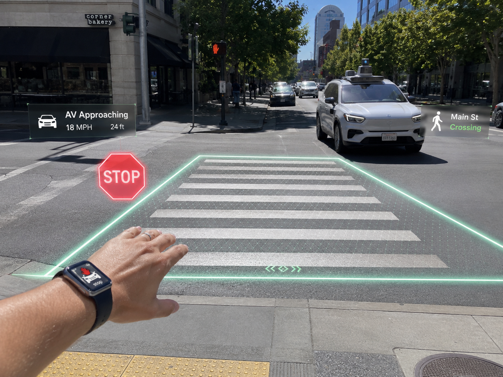

**Projected Road Cue.** Light projection onto the road, crosswalk, or pedestrian zone is spatially intuitive and visible to nearby VRUs, but sensitive to lighting, weather, road surface, and occlusion.

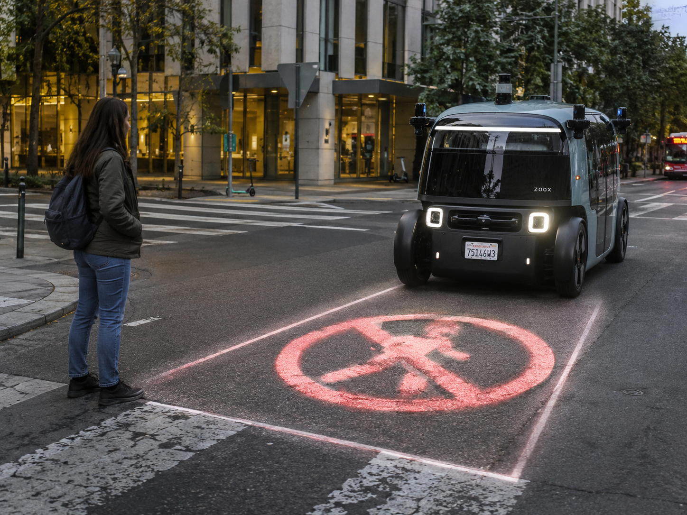

**Pedestrian-Facing Vehicle Display.** An LED panel, light band, or exterior vehicle screen is vehicle-integrated and deployment-friendly, but limited by viewing angle, distance, and cue-standardization needs.

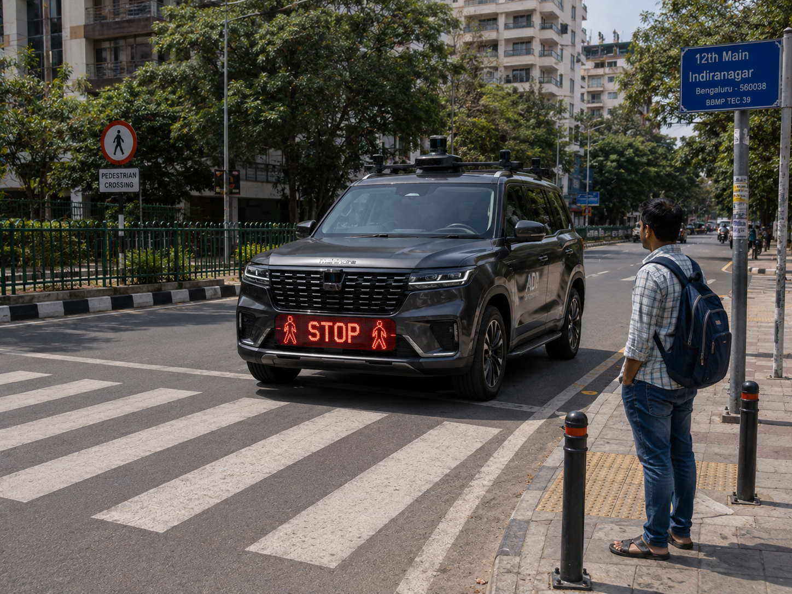

### 6. Limitations

Several limitations constrain the scope of the conclusions drawn from this evaluation.

**Dataset scale and imbalance.** The evaluated corpus of 231 clips is unevenly distributed across sources: nuScenes v1.0-mini clips were extracted from only 9 of 10 source scenes, Waymo from 13, and Argoverse 2 from 16. The ablation study further limits evaluation to a 151-scenario subset, so model contributions should be viewed as indicative rather than comprehensive. Because Argoverse 2 lacks timed warnings, lead-time results are not demonstrated in the intersection and merge scenarios that Argoverse 2 primarily represents.

**Proxy ground-truth labels.** Proxy ground-truth tier labels are derived from fixed distance and time-to-collision thresholds, not human annotation or crash data. This method ensures consistency and reproducibility but does not account for context-dependent risk perception, such as VRU attentiveness, yielding intent, or right-of-way ambiguity. Furthermore, since distance and TTC together contribute 0.60 to the fused risk score, the reported tier accuracy partly reflects structural alignment between the scoring formula and label definition.

**Consequence severity not modeled.** The fused risk score incorporates likelihood signals, proximity, closing rate, and environmental context, but does not explicitly model the severity of a potential collision, such as closing speed at impact, VRU vulnerability, or expected injury severity. Including consequence severity is a recommended direction for future refinement of the fusion formula.

**Conservative escalation behavior.** The reference implementation demonstrates conservative escalation, as shown by the gap between assigned and proxy ground-truth tier distributions and the low emergency recall. The four risk tiers are delimited by fixed score thresholds selected as round numbers rather than empirically calibrated cutoffs. This conservative approach was not adjusted for a target false-alarm rate.

**Synthetic and conceptual deployment elements.** The synthetic near-miss subset is generated through simulation rather than collected from naturalistic VRU interactions. The cue delivery channels are conceptual and have not been validated in hardware. No human-subject studies on cue perception, reaction time, trust, or habituation were conducted.

**Offline evaluation.** Evaluation was conducted offline on pre-recorded clips. Closed-loop performance under real-time sensing noise, actuation latency, communication delay, and adversarial or unusual VRU behavior remains untested.

### 7. Conclusion and Future Directions

PRISM-AR extends the inverse crash-probability safety-scoring foundation of SafeDriver-IQ and the multi-model risk engine of PRISM to real-time, VRU-facing proactive safety cues. By integrating environmental, trajectory, and VRU-interaction risk streams through a transparent decision layer, PRISM-AR generates a graduated four-tier cue policy, moving beyond binary alerts. Evaluation across 231 dataset-derived and synthetic near-miss scenarios shows that the adaptive tier policy achieves 70.9% proxy tier accuracy, compared with 42.6% for a static baseline. Warning and emergency recall rates rise from 0% under the static baseline to 19.6% and 9.1%, respectively. Escalated warnings provide a mean escalation lead time of 2.99 s before the closest ego-VRU approach, while the fused safety score correlates strongly with minimum approach distance (Pearson r = 0.82). Cue behavior remains temporally stable, with dataset-level mean flicker rates below 1.2 Hz, and visual load is concentrated primarily in high-risk synthetic near-miss encounters rather than routine dataset-derived driving.

The ablation study confirms that each risk model contributes uniquely, with the VRU interaction model acting as a specificity filter, balancing the trajectory and environmental models' sensitivity to escalating risk. Overall, these findings support graduated, proximity-aware cue delivery as a promising approach for VRU-facing AR and eHMI safety interfaces.

Immediate future directions include expanded naturalistic-dataset evaluation to rebalance the dataset composition and support stronger per-dataset conclusions; false-alarm-aware policy tuning to allow deliberate selection of the recall-specificity tradeoff; human-subject validation of the VRU-facing cue channels to link proximity and timing metrics to measured pedestrian reaction time, comprehension, trust, and habituation; closed-loop deployment testing first in simulation and then on a physical platform; and application of the risk-tiering and cue-generation approach to driver-facing feedback in partially automated (SAE L2/L3) vehicles.

### Phase 3 Authors

- Joyjit Roy
- Meng Lu
- Arijit Roy
- Sushanta Das
- Samaresh Kumar Singh

# <span style="color:blue">Key Innovations</span>

### Phase 1: SafeDriver-IQ

| Traditional Approach | SafeDriver-IQ (Novel) |
|---------------------|----------------------|
| Binary crash prediction | Continuous safety score (0-100) |
| "30% crash risk" | "Safety score: 72/100 → Improve to 85+" |
| Reactive warnings | Proactive guidance with specific actions |
| General risk factors | VRU-specific safety models |
| CRSS-only training | CRSS + Waymo + synthesised contextual features |

**Novel Contributions (Phase 1):**
1. **Inverse Safety Score Formulation** - Continuous safety metric (0-100) instead of binary crash prediction
2. **Good Driver Profile Extraction** - First empirical characterisation of safe driving from crash data + Waymo behavioural data
3. **VRU-Specific Safety Modeling** - Dedicated models for pedestrian, cyclist, and work zone encounters
4. **Contextual Feature Synthesis** - 16 research-calibrated risk dimensions generated from `ContextualFeatureGenerator` to fill CRSS data gaps
5. **Multi-Method Feature Consensus** - Random Forest, XGBoost, Permutation Importance, and SHAP combined into a single consensus ranking
6. **Real-Time Integration Architecture** - Practical system design for in-vehicle deployment

### Phase 2: PRISM

| Traditional Approach | PRISM (Novel) |
|---------------------|----------------------|
| Single risk model | Three parallel risk models (environmental, trajectory, VRU interaction) fused by an RL agent |
| Static thresholds on one score | Q-net RL policy selecting one of four graduated intervention tiers |
| One-shot decisions | Short-term and long-term memory across decisions |
| Opaque model output | Per-decision SHAP-based explanations |
| Dataset-specific retraining | Cross-dataset calibration (nuScenes, Argoverse 2, Waymo WOMD) without retraining |

**Novel Contributions (Phase 2):**
1. **Multi-Model Risk Fusion** - Parallel environmental, trajectory-kinematic, and VRU-interaction risk models integrated via reinforcement learning
2. **Agentic Tiered Decision Policy** - Q-net RL policy replacing static thresholds, with an asymmetric reward that penalizes under-reaction 2x over over-reaction
3. **Social-Force + LSTM VRU Modeling** - Physics-informed Social Force Model combined with a learned LSTM residual correction for ego-VRU conflict prediction
4. **Explainable Agentic Reasoning** - SHAP-based per-decision explanations with short/long-term memory
5. **Cross-Dataset Generalization** - Validated on nuScenes, Argoverse 2, and Waymo WOMD without retraining

### Phase 3: PRISM-AR

| Traditional Approach | PRISM-AR (Novel) |
|---------------------|----------------------|
| Static, predefined eHMI signals | Risk-adaptive AR cues driven directly by PRISM's fused risk state |
| Binary or single-level warnings | Four-tier graduated external communication (silent, information, warning, emergency) |
| External signals disconnected from AV's internal state | External communication explicitly grounded in explainable internal risk reasoning |
| Single-condition evaluation | 231 scenario clips across three public AV datasets plus controlled near-miss scenarios |

**Novel Contributions (Phase 3):**
1. **Risk-Adaptive External Communication** - First framework directly linking an AV's internal fused risk state to VRU-facing AR cues
2. **Explainable Tiered Escalation** - Four-level cue policy (silent, information, warning, emergency) grounded in the fused PRISM risk score
3. **Cue-Risk Monotonicity Validation** - Spearman ρ = -0.703 (Wilcoxon p < 0.0001) alignment between cue intensity and risk severity
4. **Real-Time Feasibility** - Sub-millisecond per-frame reference implementation
5. **Multi-Baseline Evaluation Protocol** - Paired comparison against no-interface, static eHMI, and oracle upper-bound policies

# <span style="color:blue">Dataset</span>

**CRSS (Crash Report Sampling System)** — NHTSA national crash database
- **417,335 crash records** (2016–2023, 8 years)
- **38,462 VRU crashes** (pedestrians + cyclists, raw CRSS records); Phase 1 uses **23,194 unique VRU crash records** after filtering and deduplication
- **1,032,571 person records**
- Tables: `ACCIDENT`, `VEHICLE`, `PERSON`, `PBTYPE`, `FACTOR`, `DISTRACT`, `DRIMPAIR`, `WEATHER`, and more

**Waymo Open Motion Dataset (WOMD v1.2)** — Real-world autonomous driving scenarios
- **6 splits**: training (1,000 shards), training_20s, validation, validation_interactive, testing, testing_interactive
- **91 timesteps per scenario** at 10 Hz (1 s context + 8 s future horizon)
- Captures: agent trajectories (vehicles, pedestrians, cyclists), road graph, traffic signals, speed limits
- Used for: Good driver profiling, near-miss detection, behavioral pattern extraction
- Stored via **Git LFS** in `data/waymo/motion_dataset/`

**nuScenes v1.0-mini** — Public autonomous-driving benchmark
- **10 scenes**, 12 sensors (6 cameras, 5 radars, 1 LiDAR)
- Full 3D bounding-box tracks for vehicles, pedestrians, and cyclists
- Used for: PRISM/PRISM-AR validation in complex urban intersections and adverse-lighting scenes
- Stored under `phase2-prism/datasets/nuscenes-mini/`

**Argoverse 2** — Large-scale motion forecasting dataset
- **24,988 scenarios** in the validation split (1,000 sampled as PRISM/PRISM-AR candidate clips)
- 10 Hz agent tracks (position, velocity, heading) across multiple US cities
- Used for: PRISM/PRISM-AR validation across diverse urban environments and per-city breakdowns
- Stored under `phase2-prism/datasets/argoverse2-val/`

### Dataset Summary by Paper

| Paper | Dataset | Size | Type | Purpose |
|---|---|---|---|---|
| Phase 1 (EIT2026) | NHTSA CRSS 2016–2023 | 417,335 crash records | Historical crash outcomes | Train inverse crash probability model |
| Phase 2 (ASCE2027) | nuScenes mini | 10 scenarios | Autonomous driving scenes | Validate PRISM across diverse urban environments |
| Phase 2 (ASCE2027) | Argoverse 2 | 1,000 scenarios | Autonomous driving scenes | Validate PRISM across diverse urban environments |
| Phase 2 (ASCE2027) | Waymo WOMD | 286 scenarios | Autonomous driving scenes | Validate PRISM across diverse urban environments |
| Phase 3 (PRISM-AR/TVT) | nuScenes v1.0-mini | 10 source scenes → 96 evaluated clips | VRU-interaction clips | Evaluate risk-adaptive AR cues |
| Phase 3 (PRISM-AR/TVT) | Argoverse 2 | 1,000 candidate → 50 evaluated clips | VRU-interaction clips | Evaluate risk-adaptive AR cues |
| Phase 3 (PRISM-AR/TVT) | Waymo WOMD | 286 candidate → 25 evaluated clips | VRU-interaction clips | Evaluate risk-adaptive AR cues |
| Phase 3 (PRISM-AR/TVT) | Synthetic near-miss generator | 60 scenarios | Controlled pedestrian-crossing scenes | Supplement rare warning/emergency cases |

Phase 3 candidate clips are drawn from the same three AV datasets as Phase 2 (1,296 total candidate clips), then filtered by a VRU-interaction extractor (20 m ego-approach radius, decreasing distance, ≥5 frames visible) down to 231 total evaluated scenario clips. See [`phase3-prism-ar/README.md`](phase3-prism-ar/README.md) and `phase3-prism-ar/src/prism_ar/dataset_generation/scenario_extractor.py` for the extraction logic.

# <span style="color:blue">Data Management</span>

The repository keeps small, shareable datasets in `data/` and expects large AV datasets to live outside the repo to avoid GitHub file-size and Windows `MAX_PATH` issues.

- `data/crss/` — NHTSA CRSS (2016–2023), used by Phase 1 and Phase 2.
- `data/waymo/` — Waymo Open Motion Dataset TFRecord files, used by all phases.
- `data/processed/` — Derived parquet/CSV artifacts.
- `phase2-prism/datasets/` — Local nuScenes and Argoverse 2 data (not tracked; add this folder to `.gitignore` if you create it).
- `phase3-prism-ar/data/prism_ar/` — Generated PRISM-AR annotations and rendered AR overlay images.

To point Phase 2 and Phase 3 at external datasets, set the `SDIQ_*` environment variables in `phase2-prism/src/sdiq/config.py` or use Windows directory junctions (e.g. `C:\data_prismar\nuscenes`, `C:\data_prismar\argoverse2`, `C:\data_prismar\waymo`, `C:\data_prismar\crss`).
## Project Structure

```
├── data/                          # Shared datasets (CRSS, Waymo, processed)
│   ├── crss/                      # NHTSA CRSS crash database (2016-2023)
│   │   ├── 2016/
│   │   ├── 2017/
│   │   └── ...
│   ├── processed/                 # Cleaned/derived datasets
│   └── waymo/                     # Waymo Open Motion Dataset (Git LFS)
│       └── motion_dataset/
│           ├── datasets_scenario/ # Scenario-format TFRecords
│           └── tf_example_datasets/ # TF Example-format TFRecords
├── docs/                          # Shared documentation
│   ├── images/                    # Architecture diagrams, PRISM mockups
│   └── flyers/                    # Research flyers (Phase 1 + 2 + 3)
├── phase1-safedriver-iq/          # Phase 1: inverse crash modeling
│   ├── app/                       # Streamlit dashboard
│   ├── notebooks/                 # Jupyter notebooks (01-04)
│   ├── results/                   # Models, figures, tables
│   ├── src/                       # Core SafeDriver-IQ package
│   │   ├── data_loader.py
│   │   ├── preprocessing.py
│   │   ├── feature_engineering.py
│   │   ├── models.py
│   │   ├── safety_score.py
│   │   ├── realtime_calculator.py
│   │   ├── scenario_simulator.py
│   │   ├── contextual_feature_generator.py
│   │   ├── crash_insights.py
│   │   ├── driver_behavior_classifier.py
│   │   ├── feature_importance.py
│   │   ├── waymo_data_loader.py
│   │   └── visualization.py
│   ├── src/agent/                 # Real-time agentic decision layer
│   ├── src/simulation/
│   ├── tests/                     # Pytest suite
│   └── retrain_model.py, run_complete_demo.py, demo_quick.py, demo_agentic_ai.py, start.sh, ...
├── phase2-prism/                  # Phase 2: agentic multi-model PRISM
│   ├── asce2027/                  # ASCE2027 validation artifacts
│   │   ├── scripts/               # Analysis scripts (AV2, Waymo, nuScenes)
│   │   ├── data/                  # Validation results (CSV/JSON)
│   │   └── figures/               # Paper figures
│   ├── docs/                      # setup, implementation plan, architecture docs
│   ├── reference/                 # Original sanity scripts
│   ├── src/sdiq/                  # config, data loaders, models, agentic layer
│   └── tests/                     # Pytest suite (61 tests)
└── phase3-prism-ar/               # Phase 3: risk-adaptive AR cues for VRUs
    ├── data/                      # Scenario annotations + rendered AR images
    ├── docs/                      # PAPER_PLAN.md, architecture docx, Backups/
    ├── notebooks/
    ├── results/                   # CSVs, JSON, figures, report.md
    ├── scripts/                   # run_*.py, generate_*.py, measure_*.py
    ├── src/prism_ar/              # data_ingestion, prism, ar_overlay, ...
    └── tests/                     # Unit tests
```

## Quick Start (5 Minutes)

### Prerequisites
- Python 3.12+ installed
- CRSS data downloaded to `data/crss/` directory
- Terminal/Command line access

### Setup & Run

```bash
# Navigate to project directory
cd Vehicle_Safety_Research

# Create virtual environment
python -m venv venv

# Activate (Windows)
venv\Scripts\activate
# Activate (Linux/Mac)
# source venv/bin/activate

# Install dependencies
pip install --upgrade pip
pip install -r requirements.txt

# Verify data loading (shows 417K+ crashes)
python phase1-safedriver-iq/test_data_loader.py

# Run COMPLETE demonstration (trains model + all features)
python phase1-safedriver-iq/run_complete_demo.py --quick

# Or run quick data demo
python phase1-safedriver-iq/demo_quick.py

# Or explore interactively
jupyter notebook phase1-safedriver-iq/notebooks/01_data_exploration.ipynb

# Launch interactive dashboard (after training model)
streamlit run phase1-safedriver-iq/app/streamlit_app.py
```

### Expected Output
```
✓ 417,335 total crashes loaded
✓ 38,462 VRU crashes identified
✓ Data from 2016-2023 successfully loaded
```

## Quick Start — Phase 2 (PRISM)

Phase 2 lives in its own isolated environment under `phase2-prism/` and does not share Phase 1's virtualenv.

```bash
cd phase2-prism

# Show resolved dataset/model paths
.venv/bin/python -m sdiq.config

# Run the test suite (61 tests)
.venv/bin/python -m pytest -q

# Smoke-test the unified data loaders (nuScenes + AV2)
.venv/bin/python -m sdiq.data_loader

# Run the full agentic pipeline end-to-end (graduated output per nuScenes scene)
.venv/bin/python -m sdiq.main run

# Compare Phase 1 vs Phase 2 intervention coverage
.venv/bin/python -m sdiq.main coverage

# Per-model ablation (marginal effect of env/trajectory/VRU)
.venv/bin/python -m sdiq.main ablations

# Per-layer latency breakdown
.venv/bin/python -m sdiq.main latency
```

See [phase2-prism/README.md](phase2-prism/README.md) for milestone status and [phase2-prism/docs/setup.md](phase2-prism/docs/setup.md) for environment details.

## Quick Start — Phase 3 (PRISM-AR)

Phase 3 also lives in its own folder (`phase3-prism-ar/`) with an editable `src/` layout, independent of Phase 1 and Phase 2's environments.

```bash
cd phase3-prism-ar

# 1. Install dependencies (editable install using the src/ layout in pyproject.toml)
pip install -r requirements.txt
pip install -e .

# 2. Run tests
pytest phase3-prism-ar/tests/ -v

# 3. Run the full real-data pipeline (Waymo + Argoverse 2 + nuScenes + synthetic near-miss)
python scripts/run_prism_ar_real_data.py --max_scenes 50

# 4. Generate the paper figures
python scripts/generate_prism_ar_figures.py

# 5. Run ablation and robustness studies
python scripts/run_ablation_study.py
python scripts/run_robustness_study.py
```

On Windows, `scripts/setup_venv.bat` can be used instead of step 1 to create an isolated virtual environment first. See [phase3-prism-ar/README.md](phase3-prism-ar/README.md) for dataset path configuration and implementation notes.

## Detailed Setup Instructions

### Step 1: Clone/Download Project
```bash
cd /path/to/your/workspace
git clone https://github.com/joyjitroy/Vehicle_Safety_Research.git
cd Vehicle_Safety_Research
```

### Step 2: Create Virtual Environment
```bash
python -m venv venv

# Activate (Windows)
venv\Scripts\activate
# Activate (Linux/Mac)
# source venv/bin/activate
```

### Step 3: Install Dependencies
```bash
pip install --upgrade pip
pip install -r requirements.txt
```

This installs:
- **Data Processing:** pandas, numpy, pyarrow
- **Machine Learning:** scikit-learn, xgboost, lightgbm
- **Visualization:** matplotlib, seaborn, plotly
- **Model Interpretation:** shap
- **Interactive:** jupyter, streamlit

### Step 4: Extract CRSS Data
If data is still zipped:
```bash
cd data/crss
for year in 2016 2017 2018 2019 2020 2021 2022 2023; do
    unzip -o ${year}/CRSS${year}CSV.zip -d ${year}/
done
cd ..
```

### Step 5: Verify Setup
```bash
python phase1-safedriver-iq/test_data_loader.py
```

Should show successful loading of 417K+ crash records.

### Step 6: Run Tests (Optional)
```bash
# Activate virtual environment (REQUIRED before running tests)
venv\Scripts\activate     # Windows
# source venv/bin/activate  # Linux/Mac

# Install test dependencies
pip install -r requirements-test.txt

# Run all tests with basic output
pytest

# Run all tests with verbose output and short traceback (recommended)
pytest phase3-prism-ar/tests/ -v --tb=short

# Run all tests with verbose output and one-line traceback (most concise)
pytest phase3-prism-ar/tests/ -v --tb=line

# Run tests without coverage calculation (faster)
pytest phase3-prism-ar/tests/ -v --tb=short --no-cov

# Run tests in quiet mode with one-line traceback (minimal output)
pytest tests/ -q --tb=line

# Run with coverage report (detailed analysis)
pytest --cov=src --cov-report=html

# View coverage report
open htmlcov/index.html  # On Mac
# xdg-open htmlcov/index.html  # On Linux
```

**Test Output Options:**
- `-v` = verbose mode (shows each test name)
- `-q` = quiet mode (minimal output, just pass/fail counts)
- `--tb=short` = shorter traceback on failures (recommended for debugging)
- `--tb=line` = one-line traceback (most concise, good for CI/CD)
- `--no-cov` = skip coverage calculation (faster test runs)

**Test Realtime Calculator** (verifies condition changes affect scores):
```bash
# Run realtime calculator tests to verify model sensitivity
pytest tests/test_realtime_calculator.py -v --tb=short -s
```

Expected: 65 tests total (53 pass + 12 realtime tests with 5 expected failures due to known model limitations)

## Pipeline

> **Note:** the step numbers below are internal sub-stages within each phase's own pipeline — they are unrelated to the SafeDriver-IQ (Phase 1) / PRISM (Phase 2) / PRISM-AR (Phase 3) numbering used elsewhere in this README.

### Phase 1: SafeDriver-IQ Pipeline

**Step 1 — Data Preparation**
- Load CRSS datasets (2016-2023)
- Load Waymo Open Motion Dataset (TFRecord parsing via `WaymoDataLoader`)
- Filter VRU crashes
- Feature engineering (120+ variables)
- Create exposure-weighted baseline

**Step 2 — Crash Factor Investigation (Notebook 04 — NEW)**
- **Investigation 1** — Primary crash factors (temporal, environmental, VRU interactions)
- **Investigation 2** — Feature selection via 4-method consensus (RF, XGBoost, Permutation, SHAP)
- **Investigation 3** — Driver behavior classification (CRSS crash clusters + Waymo good-driver profiling)
- **Investigation 4** — Critical data for crash/VRU prediction
- **Investigation 5** — Crash prevention patterns and high-risk combinations
- **Investigation 6** — Historical year-over-year trends (2016–2023)
- **Investigation 7** — Environmental uniqueness analysis (rare high-severity conditions)
- **Investigation 8** — Root cause analysis causal chain framework
- **Section 6** — Contextual feature synthesis with `ContextualFeatureGenerator` (16 research-calibrated risk factors)

**Step 3 — Crash Pattern Analysis**
- Clustering → Identify crash archetypes
- Association Rules → Find co-occurring risk factors
- Feature Importance → Rank risk contributors

**Step 4 — Inverse Safety Model**
- Train crash classifier (Random Forest / XGBoost, n_estimators=200)
- Extract decision boundaries
- Compute "distance from crash boundary" = Safety Score
- Profile "good driver" = maximises safety score (using Waymo behavioural data)

**Step 5 — Validation & Visualization**
- Cross-validation metrics
- SHAP analysis for interpretability
- Dashboard for results presentation

### Phase 2: PRISM Pipeline

Implemented as milestones M0–M8 in `phase2-prism/`:

- **M0 — Environment & data**: isolated `.venv`, devkit-free nuScenes, config-driven sanity tests
- **M1 — Unified data loaders**: `DrivingScene` / `AgentTrack` / `EgoState` over nuScenes + Argoverse 2
- **M2 — Environmental risk bridge**: reuses the frozen Phase 1 Random Forest as a context multiplier
- **M3 — Trajectory-kinematics**: Savitzky-Golay features + a 2-layer anticipatory LSTM
- **M4 — VRU interaction**: Social Force Model + LSTM residual correction
- **M5 — Scenario summary**: fuses all three risk models into one `ScenarioSummary` (the M6/M7 integration contract)
- **M6 — Agentic reasoning**: Q-net RL policy over the fused state → 4 graduated tiers, with SHAP explanations and memory
- **M7 — LLM co-pilot**: off the safety-critical path; scenario summaries and intervention narration
- **M8 — End-to-end + evaluation**: `AgenticPipeline` runs all layers; coverage, ablation, and latency evaluations

### Phase 3: PRISM-AR Pipeline

Implemented in `phase3-prism-ar/scripts/run_prism_ar_real_data.py`:

1. Load Waymo, Argoverse 2, and nuScenes mini scenes (plus the synthetic near-miss generator)
2. Extract AR-relevant VRU interaction clips via the scenario extractor
3. Run the PRISM risk engine (`TrainedPRISMRiskEngine`) on each clip
4. Generate paired overlays: no-AR, static, adaptive, and oracle
5. Compute evaluation metrics (tier accuracy, recall, cue-risk monotonicity, warning lead time, cue flicker, visual clutter)
6. Save the results CSV, summary tables, and sample overlay images

## ASCE2027 Validation Artifacts

The `phase2-prism/asce2027/` folder contains the reproducibility bundle for the ASCE2027 conference paper:

- **Scripts**: `compute_stats.py`, `check_tier_mapping.py`, `find_thresholds.py`, `sensitivity_final.py`, `av2_and_shap_outputs.py`, `fig2_score_distribution_final.py`, `generate_paper_outputs.py`, `waymo_validation.py`, `waymo_validation_run.py`
- **Data**: `av2_validation_1000.csv`, `av2_validation_by_city.csv`, `av2_scenario_summary.csv`, `scenario_summary.csv`, `waymo_validation_results.json`, `waymo_scenario_summary.csv`, `fig2_score_distribution_data.csv`
- **Figures**: Score distribution, tier distribution, ablation, latency, near-miss, SHAP, and VRU proximity plots

These artifacts support the paper's results: mean safety score 68/100, 77.6% advisory, 3.8% near-miss rate, and ~11% escalation to intervention/emergency.

### Reproducing the ASCE2027 figures/tables

```bash
cd phase2-prism/asce2027/scripts
python generate_paper_outputs.py   # regenerates data/ and figures/ from validation results
python compute_stats.py            # summary statistics used in the paper
python check_tier_mapping.py       # verifies score-to-tier assignment
python find_thresholds.py          # threshold search used for tier boundaries
python sensitivity_final.py        # sensitivity analysis
```

## PRISM-AR (TVT) Validation Artifacts

The `phase3-prism-ar/` folder contains the reproducibility bundle for the PRISM-AR IEEE TVT manuscript:

- **Scripts** (`phase3-prism-ar/scripts/`): `run_prism_ar_real_data.py`, `run_ablation_study.py`, `run_robustness_study.py`, `generate_prism_ar_figures.py`, `generate_prism_ar_report.py`, `generate_prism_ar_dataset.py`, `measure_prism_ar_latency.py`
- **Data** (`phase3-prism-ar/results/`): `prism_ar_results.csv`, `prism_ar_summary.json`, `ablation_results.csv`, `robustness_results.csv`, `latency_results.json`, `report.md`, and per-metric tables in `tables/` (`ablation.csv`, `adverse_condition.csv`, `ground_truth_comparison.csv`, `main_by_dataset.csv`, `robustness.csv`)
- **Figures** (`phase3-prism-ar/results/figures/`): architecture diagram (F1), mean safety scores by dataset (F2), tier distribution (F3), ground-truth comparisons (F4, F5), lead-time distribution (F6), distance-vs-score (F7), dataset metrics (F8), ablation (F9), AR cue mockups — HMD overlay, projected cue, vehicle display (F10a–d), and the evaluation-flow diagram (F11)
- **Rendered overlay images** (`phase3-prism-ar/results/images/`): paired no-AR / static / adaptive / oracle frames for representative Waymo, Argoverse 2, and nuScenes clips

These artifacts support the paper's results: 231 evaluated scenario clips, tier accuracy 0.43 → 0.71, cue-risk monotonicity ρ = -0.703 (p < 0.0001), and sub-millisecond per-frame latency. See [Quick Start — Phase 3 (PRISM-AR)](#quick-start--phase-3-phase3-prism-ar) above to regenerate them.

## Runnable Entry Points

| Phase | Entry point | What it demonstrates |
|---|---|---|
| Phase 1 | `phase1-safedriver-iq/notebooks/01_data_exploration.ipynb` | CRSS data quality, VRU trends, temporal patterns |
| Phase 1 | `notebooks/02_train_inverse_model.ipynb` | Full inverse safety model training |
| Phase 1 | `phase1-safedriver-iq/notebooks/03_shap_analysis.ipynb` | SHAP interpretability deep-dive |
| Phase 1 | `notebooks/04_crash_factor_investigation.ipynb` | 8-investigation crash factor analysis with Waymo |
| Phase 2 | `python -m sdiq.main run` (inside `phase2-prism/.venv`) | End-to-end PRISM agentic pipeline |
| Phase 3 | `scripts/run_prism_ar_real_data.py` | PRISM-AR real-data AR cue evaluation |

## Expected Impact

With 20% adoption of the SafeDriver-IQ family (Phase 1 scoring, Phase 2 PRISM agentic intervention, Phase 3 PRISM-AR external VRU communication), the system could prevent:
- **1,500 pedestrian deaths/year** (20% reduction)
- **200 cyclist deaths/year** (20% reduction)
- **170 work zone deaths/year** (20% reduction)
- **30,000 VRU injuries/year** (20% reduction)

Phase 2 and Phase 3 extend this impact from human-driven vehicles to autonomous vehicle fleets by translating the same risk reasoning into real-time internal interventions and external VRU-facing AR cues.

**Total impact: 1,870+ lives saved annually**

## Documentation

- **[README.md](README.md)** — Project overview & setup (this file)
- **[PROJECT_SETUP_SUMMARY.md](PROJECT_SETUP_SUMMARY.md)** — Detailed Phase 1 setup reference
- **[notebooks/04_crash_factor_investigation.ipynb](notebooks/04_crash_factor_investigation.ipynb)** — Comprehensive crash factor investigation
- **[phase2-prism/README.md](phase2-prism/README.md)** — PRISM (Phase 2) overview and quick start
- **[phase2-prism/docs/setup.md](phase2-prism/docs/setup.md)** — PRISM environment setup details
- **[phase3-prism-ar/README.md](phase3-prism-ar/README.md)** — PRISM-AR (Phase 3) overview and quick start
- **[phase3-prism-ar/docs/PAPER_PLAN.md](phase3-prism-ar/docs/PAPER_PLAN.md)** — PRISM-AR IEEE TVT submission plan
- **[phase3-prism-ar/results/report.md](phase3-prism-ar/results/report.md)** — PRISM-AR generated evaluation report

## Known Issues & Limitations

**Phase 1 limitation:** The current trained inverse crash model does not respond meaningfully to changes in **road condition**, **VRU presence**, or **speed relative to limit**. This is a fundamental limitation of training on crash-only data: the model never learned what "truly safe" driving looks like. It remains useful for weather, lighting, and temporal risk patterns. For test evidence, run `pytest tests/test_realtime_calculator.py -v --tb=short`.

**Phase 2 mitigation:** PRISM addresses the Phase 1 limitation by adding separate trajectory-kinematic and VRU-interaction models, plus a DQN fusion agent. Validation results are in the `phase2-prism/asce2027/` directory.

**Phase 3 current scope:** PRISM-AR's reported results use a deterministic, fixed-weight risk-fusion pipeline rather than the agentic DQN+SHAP extension. The four-tier labels in the paper (Silent, Information, Warning, Emergency) differ from the current codebase labels (silent, advisory, intervention, emergency); these map to the same escalation levels. The agentic extension is designed but not evaluated in the current reference results.

## Contributing

| Phase | Where to start |
|---|---|
| Phase 1 | Review [notebooks/04_crash_factor_investigation.ipynb](notebooks/04_crash_factor_investigation.ipynb) and run `phase1-safedriver-iq/demo_quick.py` |
| Phase 2 | See [phase2-prism/README.md](phase2-prism/README.md) and run `.venv/bin/python -m sdiq.main run` |
| Phase 3 | See [phase3-prism-ar/README.md](phase3-prism-ar/README.md) and run `scripts/run_prism_ar_real_data.py` |
| All phases | Check the issues tab for planned features and collaboration ideas |

## Authors

| Author | Affiliation / Role | Phases |
|---|---|---|
| Joyjit Roy | Independent Researcher, IEEE Senior Member, Austin TX | Phase 1, 2, 3 |
| Samaresh Kumar Singh | Independent Researcher, IEEE Senior Member, Leander TX | Phase 1, 2, 3 |
| Sushanta Das | American Center for Mobility, Ypsilanti MI | Phase 1, 2, 3 |
| Mojtaba Bahramgiri | Department of ECE & Applied Computing, Michigan Technological University | Phase 1 |
| Meng Lu | Aeolix ITS / Macau University of Science and Technology | Phase 3 |
| Arijit Roy | Independent Researcher, Kolkata, India | Phase 3 |

## License

[To be determined - typically MIT or Apache 2.0 for research code]

## Acknowledgments

- **American Center for Mobility (ACM)** for collaboration and domain guidance as a federally designated CAV proving ground
- **NHTSA** for CRSS data availability
- **Waymo, Argoverse 2, and nuScenes** teams for open autonomous-driving datasets used in Phases 2 and 3
- **SafeDriver-IQ** novel methodology development
- Python scientific computing community (pandas, scikit-learn, etc.)

