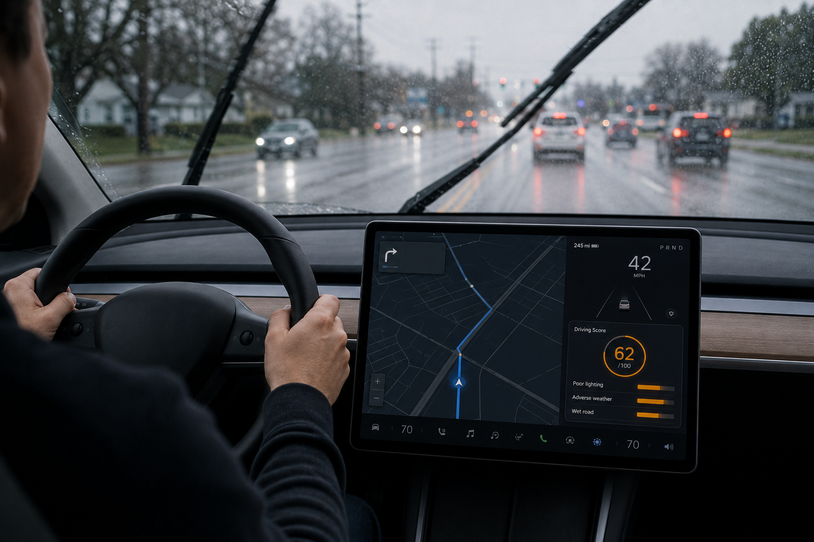
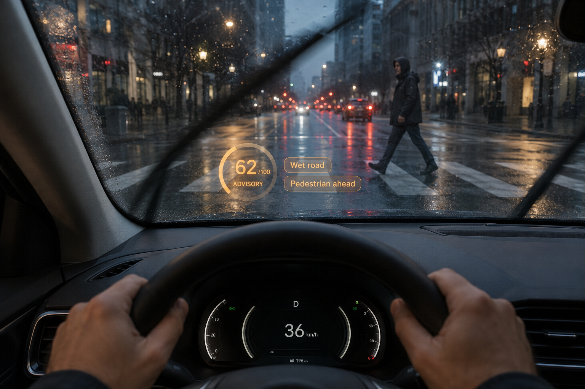
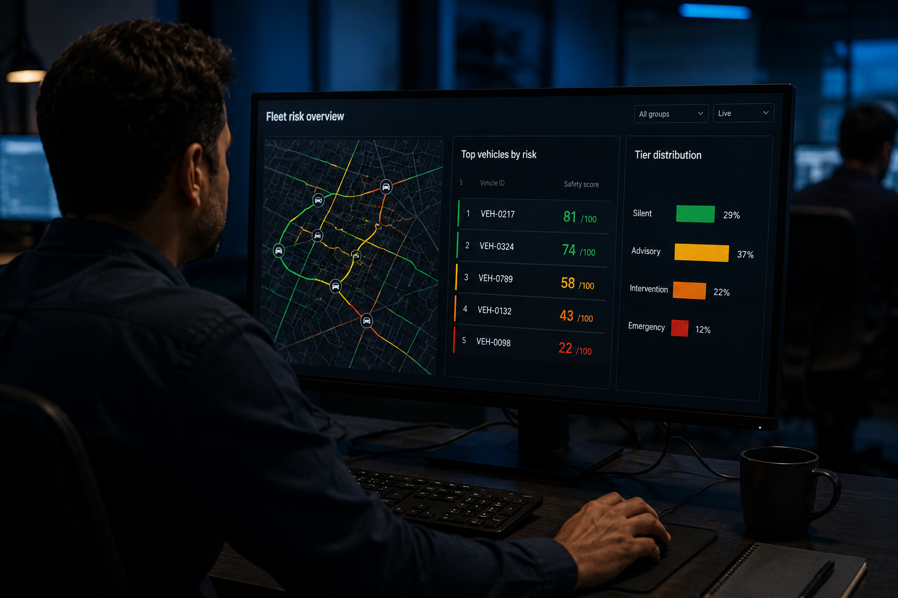

# Vehicle Safety Research: Multi-Phase Research Framework for Proactive Vehicle Safety and VRU-Aware Risk Communication

**Tagline:** *"From Crash Prediction to Proactive, Explainable Safety Intelligence"*

> **Note:** The GitHub repository will be renamed from `joyjitroy/safedriver-iq` to `joyjitroy/VehicleSafetyResearch`.

[](https://www.python.org/downloads/)
[](https://opensource.org/licenses/MIT)
[](phase1-safedriver-iq/src/agent/)

## Project Overview

SafeDriver-IQ transforms crash data into a continuous safety score that tells drivers in real-time how close they are to crash conditions and what specific actions would make them safer, with special focus on protecting vulnerable road users (VRUs).

### 🆕 NEW: Comprehensive Crash Factor Investigation (Notebook 04)
A deep-dive multi-dataset investigation combining **CRSS** (417K crashes) and **Waymo Open Motion Dataset** to answer 8 core research questions:
1. What factors contribute to vehicle crashes?
2. Which features best predict crash probability?
3. How to classify driver behavior from crash and good-driving data?
4. What data is most critical for VRU/pedestrian/cyclist predictions?
5. What patterns can improve crash prevention model training?
6. What historical crash trends are present across 2016–2023?
7. What environmental conditions uniquely elevate crash risk?
8. How to systematically perform root cause analysis?

**Key addition — Contextual Feature Synthesis:** CRSS captures crash *outcomes* but is silent on contextual preconditions. A new `ContextualFeatureGenerator` synthesises 16 research-calibrated risk dimensions (see [Section 6](#section-6--comprehensive-crash-factor-analysis-beyond-crss-data) in notebook 04) drawn from NHTSA, FHWA-HSM, AAA Foundation, and IIHS sources, enabling richer training and what-if simulation.

### 🤖 Real-Time Agentic Decision Layer (Phase 1 extension)
A rule/RL-based decision layer (`phase1-safedriver-iq/src/agent/`) wraps the Phase 1 tabular safety score with **autonomous decision-making**:
- Real-time risk assessment and autonomous interventions
- Continuous learning from driving experiences
- Multi-modal driver notifications (visual, audio, haptic)
- Transparent, explainable AI reasoning
- Code: [`phase1-safedriver-iq/src/agent/core/`](phase1-safedriver-iq/src/agent/core/) (decision engine) · [`phase1-safedriver-iq/src/agent/perception/`](phase1-safedriver-iq/src/agent/perception/) · [`phase1-safedriver-iq/src/agent/control/`](phase1-safedriver-iq/src/agent/control/) · [`phase1-safedriver-iq/src/agent/learning/`](phase1-safedriver-iq/src/agent/learning/) · [`phase1-safedriver-iq/src/agent/explainability/`](phase1-safedriver-iq/src/agent/explainability/) — see [`phase1-safedriver-iq/demo_agentic_ai.py`](phase1-safedriver-iq/demo_agentic_ai.py) to run it

> **Note:** This is a Phase 1 add-on around the single tabular safety-score model, not to be confused with **PRISM (Phase 2)**, which independently fuses three separate risk models (environmental, trajectory, VRU) via its own RL agent — see below.

### The Problem
- **7,500+ pedestrian deaths/year** in the USA (40-year high)
- **1,000+ cyclist deaths/year**
- Traditional systems are **reactive** (emergency braking) not **proactive**
- No system tells drivers "you're driving safely" or "improve these specific behaviors"

### Our Solution
Instead of predicting crashes, we model the **distance from crash** - quantifying how "safe" a driving scenario is by measuring its statistical distance from crash-producing conditions.

### 🕶️ PRISM-AR: Risk-Adaptive AR Cues for VRUs (extends PRISM / Phase 2)
PRISM-AR (in [`phase3-prism-ar/`](phase3-prism-ar/)) takes PRISM's continuous safety score and intervention tier and maps them to **adaptive augmented-reality cues** for pedestrians and cyclists — e.g., a translucent amber safe zone at "advisory", a flashing red no-cross boundary at "emergency". It is being prepared for submission to **IEEE Transactions on Vehicular Technology**. See [`phase3-prism-ar/README.md`](phase3-prism-ar/README.md) for details.

## 📄 Research Publication

This repository serves as the **reference implementation and experimental foundation** for the following research:

### Phase 2: PRISM

Phase 2 of this research, an agentic multi-model architecture for proactive safety intervention in autonomous transportation, has been accepted for presentation at the **American Society of Civil Engineers (ASCE) 2027** conference. Validation artifacts are in the [`phase2-prism/asce2027/`](phase2-prism/asce2027/) directory.

### Key Results (Phase 2)

- **1,296 scenarios** validated across nuScenes (10), Argoverse 2 (1,000), and Waymo WOMD (286)
- **Mean safety score: 68.0/100**
- **77.6%** of scenarios classified as **advisory**
- **3.8% near-miss rate**
- **~11%** escalated to **intervention/emergency**
- Cross-dataset calibration without retraining

### Phase 3: PRISM-AR

**Paper Title:** *Explainable Risk-Adaptive Driving Intelligence for Vulnerable Road User Communication in Automated Vehicles*

Phase 3 extends PRISM's internal AV risk reasoning into external, VRU-facing communication. PRISM-AR (PRISM with Augmented Reality) adds a tiered external communication policy that maps PRISM's fused risk state to adaptive AR cues for pedestrians and cyclists across four escalation levels: silent, information, warning, and emergency. Prepared for submission to **IEEE Transactions on Vehicular Technology (TVT)**, Special Issue on Advanced Driving Intelligence for Autonomous Vehicles (manuscript deadline: 1 August 2026). Source and validation artifacts are in the [`phase3-prism-ar/`](phase3-prism-ar/) directory.

**Authors:** Joyjit Roy, Meng Lu, Arijit Roy, Sushanta Das, Samaresh Kumar Singh

### Key Results (Phase 3)

- **231 scenario clips** evaluated across three public AV datasets plus controlled near-miss scenarios
- Proxy ground-truth tier accuracy improves from **0.43 (static eHMI)** to **0.71 (PRISM-AR)**
- Cue-risk monotonicity: Spearman **ρ = -0.703** (Wilcoxon p < 0.0001)
- Activates warning/emergency cues in risk-critical cases the static baseline fails to escalate
- Sub-millisecond per-frame latency (reference implementation)

### 📌 Relationship to This Project
Each phase of the SafeDriver-IQ system was **designed, implemented, and validated first**, and the insights, models, and experimental findings from this project directly led to the corresponding research publications: the Phase 1 arXiv paper, the Phase 2 ASCE2027 paper, and the Phase 3 PRISM-AR manuscript prepared for IEEE TVT.

In other words:
- ✅ This repository = **working system + experiments** (Phase 1: `phase1-safedriver-iq/`, Phase 2: `phase2-prism/`, Phase 3: `phase3-prism-ar/`)
- ✅ The papers = **formalization of methodology, results, and contributions** for each phase

### 🚀 What the Paper Formalizes
The research paper builds on this project and formally introduces:

- **Inverse Crash Probability Modeling** → foundation of the safety score  
- **Continuous Driver Safety Scoring (0–100)** instead of binary crash prediction  
- **Distance-from-crash formulation** using learned decision boundaries  
- **Integration of crash data (CRSS) + behavioral data (Waymo)**  
- **Explainable safety feedback mechanisms for real-time systems**  

### 🔬 How This Repo Maps to the Paper

| Research Concept | Implementation in This Repo |
|----------------|---------------------------|
| Inverse crash modeling | `phase1-safedriver-iq/src/safety_score.py` |
| Feature engineering (120+) | `phase1-safedriver-iq/src/feature_engineering.py` |
| Contextual risk synthesis | `phase1-safedriver-iq/src/contextual_feature_generator.py` |
| Model training (RF/XGBoost) | `phase1-safedriver-iq/src/models.py` |
| Behavioral insights | `phase1-safedriver-iq/src/driver_behavior_classifier.py` |
| Explainability (SHAP) | `phase1-safedriver-iq/notebooks/03_shap_analysis.ipynb` |
| Real-time scoring system | `phase1-safedriver-iq/src/realtime_calculator.py` |

## Phase 1: SafeDriver-IQ - Real-Time Driver Safety Scoring Through Inverse Crash Probability Modeling

### Overview

SafeDriver-IQ is the first phase of the VehicleSafetyResearch program. It introduces a framework that transforms binary crash classifiers into continuous 0-100 safety scores by combining national crash statistics with naturalistic driving data from autonomous vehicles. The framework was presented at IEEE EIT 2026 and is forthcoming in IEEE Xplore.

### Abstract

Road crashes remain a leading cause of preventable fatalities. Existing prediction models predominantly produce binary outcomes, which offer limited actionable insights for real-time driver feedback. These approaches often lack continuous risk quantification, interpretability, and explicit consideration of vulnerable road users (VRUs), such as pedestrians and cyclists.

SafeDriver-IQ fuses National Highway Traffic Safety Administration (NHTSA) crash records with Waymo Open Motion Dataset scenarios, engineers domain-informed features, and incorporates a calibration layer grounded in transportation safety literature. Evaluation across 15 complementary analyses indicates that the framework reliably differentiates high-risk from low-risk driving conditions with strong discriminative performance. Findings reveal that 87% of crashes involve multiple co-occurring risk factors, with non-linear compounding effects that increase the risk to 4.5x baseline. SafeDriver-IQ delivers proactive, explainable safety intelligence relevant to advanced driver-assistance systems (ADAS), fleet management, and urban infrastructure planning.

### 1. Introduction

Road traffic crashes are a leading cause of preventable mortality worldwide, with approximately 1.19 million fatalities annually. In the United States, NHTSA documented 40,990 traffic fatalities in 2023, and pedestrian and cyclist fatalities have increased by more than 50% over the past decade. Vehicle safety technologies have advanced, yet VRU fatalities continue to rise, highlighting a significant gap in vehicle-centric safety strategies.

Crash prediction models estimate the likelihood of a crash based on environmental and operational conditions. While valuable for infrastructure planning and hotspot identification, they offer limited utility for real-time driver feedback. Binary outputs such as "crash likely" or "crash unlikely" provide minimal actionable information. They do not convey the degree of risk or identify which factors contribute to it.

This project introduces **Inverse Crash Modeling**, a paradigm that converts binary crash classifiers into continuous safety scoring systems. SafeDriver-IQ quantifies the distance between current driving conditions and crash-producing scenarios as a continuous score from 0 to 100. The transformation uses posterior class probabilities from a trained crash classifier, with the probability of not crashing as the safety score. A well-calibrated classifier preserves these gradations, whereas conventional binary thresholding discards them.

#### Key contributions

1. **Inverse Crash Modeling Formulation** - formalizes the transformation of binary crash classifiers into continuous safety scoring functions.
2. **Dual-Dataset VRU Safety Assessment** - integrates NHTSA CRSS crash data with the Waymo Open Motion Dataset.
3. **Domain-Knowledge Calibration** - a rule-based calibration layer bridges statistical prediction with transportation safety expertise.
4. **Driver Behavior Classification and Multi-Factor Risk Analysis** - identifies four crash-involved driver profiles and demonstrates non-linear compounding effects reaching 4.5x baseline crash risk.
5. **Comprehensive Empirical Validation** - 15 analyses including ablation, cross-validation, SHAP interpretability, and real-world impact simulation demonstrate framework robustness.

### 2. Architecture


The full system architecture has four main layers:

#### Data layer

SafeDriver-IQ employs a dual-dataset strategy:

- **NHTSA CRSS (2016-2023)** - 417,335 crash-level records across 11 linked tables. After VRU filtering and deduplication, 23,194 unique VRU crash records remain.
- **Waymo Open Motion Dataset v1.2** - 500 parsed scenarios at 10 Hz over 9.1-second windows, including 9 collisions, 27 near-misses, and 464 safe-driving episodes.

Synthetic safe samples are generated by modifying high-risk CRSS features to safer values and validating them against Waymo safe-driving behavior, yielding a balanced 1:1 training set of 46,388 records.

#### Feature engineering

The pipeline produces 64 numeric features organized into 7 groups:

- **Temporal** (10): HOUR, MINUTE, MONTH, DAY WEEK, IS RUSH HOUR, IS WEEKEND
- **Environmental** (6): WEATHER, ADVERSE WEATHER, LGT COND, POOR LIGHTING
- **Location** (8): TYP INT, REL ROAD, WRK ZONE, INT HWY
- **VRU-Specific** (5): pedestrian count, cyclist count, total VRU, max VRU injury, fatal VRU
- **Interaction** (3): NIGHT AND DARK, WEEKEND NIGHT, ADVERSE CONDITIONS
- **Crash & Vehicle** (24): HARM EV, MAN COLL, ALCOHOL, MAX SEV, VE TOTAL, PEDS
- **Metadata** (8): STRATUM, REGION, URBANICITY, PJ, PSU VAR

Interaction features explicitly model compound risk scenarios such as dark combined with adverse weather.

#### Model training

Two training pipelines are used:

- **Pipeline 1: Model selection** - Random Forest, XGBoost, and Gradient Boosting are evaluated with 100 estimators and a stratified 80/20 train-test split. Random Forest is selected as the production model.
- **Pipeline 2: Feature importance and SHAP analysis** - RF and XGBoost are retrained with 200 estimators to produce stable TreeSHAP values, ablation AUC deltas, and permutation importance rankings.

#### Inverse safety score formulation

The central component of SafeDriver-IQ is the inversion of crash probability into a continuous safety score. Given a trained binary classifier and a feature vector representing current driving conditions, the raw safety score is:

**S_raw(x) = P(y = 0 | x) x 100**

where P(y = 0 | x) is the posterior safe class probability. The score is bounded, monotonic, continuous, and interpretable. A score of 75 means the model estimates a 75% probability that current conditions do not match crash patterns.

#### Domain-knowledge calibration

A multiplicative calibration layer corrects systematic model bias. Condition-specific penalty factors are derived from safety literature for road surface, weather, lighting, speed, VRU presence, and compound conditions. For example, an icy road applies a 40% penalty (alpha = 0.60), and darkness applies up to a 25% penalty.

#### Real-time system

The calibrated safety score is produced in under one millisecond from a 64-feature driving context vector. It supports configurable intervention thresholds for ADAS, fleet management, and insurance telematics.

#### SHAP-based interpretability

TreeSHAP computes Shapley values for each feature, supporting both global feature ranking and local explanation of individual scores. A negative SHAP value pushes the prediction toward crash conditions, lowering the safety score and enabling targeted recommendations.

### 3. Dataset Summary

| Component | Records | Description |
|---|---|---|
| CRSS ACCIDENT | 417,335 | Crash-level records (2016-2023) |
| CRSS VEHICLE | 469,443 | Vehicle involvement |
| CRSS PERSON | 655,675 | Person involvement |
| PBTYPE | 25,519 | Pedestrian/cyclist typing |
| +7 supplementary | - | Factor, distraction, impairment |
| WOMD parsed | 500 | 10 Hz, 9.1 s windows |
| WOMD collisions | 9 | 1.8% of scenarios |
| WOMD near-misses | 27 | 5.4% of scenarios |
| WOMD safe driving | 464 | 92.8% of scenarios |
| VRU crashes (after filter) | 23,194 | Pedestrian or cyclist involved |
| Safe samples | 23,194 | Synthetic + Waymo-validated |
| Total balanced | 46,388 | 1:1 crash-to-safe ratio |
| Training set | 37,110 | 80% stratified split |
| Test set | 9,278 | 20% stratified split |
| Numeric features | 64 | 7 feature groups |

### 4. Results

#### Precision-recall

The model attains an Average Precision (AP) of **0.891**, well above the 0.500 random baseline. At the default threshold of 0.5, the model achieves precision = **0.941** and recall = **0.480**.


#### Confusion matrix

The Random Forest model on the held-out test set (9,278 samples) shows:

- High safe-class recall: **0.970**
- High crash-class precision: **0.941**
- Moderate crash-class recall: **0.480**
- Crash-class F1-score: **0.636**


#### Risk level classification

A synthetic evaluation grid of 864 driving scenarios achieves **87.0%** overall accuracy across five risk levels. Every misclassification falls between adjacent levels, showing ordinal consistency.

#### Crash factor analysis

From the CRSS 2016-2023 subset (213,003 crashes), the most prevalent primary factors are:

- Rush hour: 75,100 (35.3%)
- Poor lighting: 62,186 (29.2%)
- Weekend driving: 53,462 (25.1%)
- Adverse weather: 49,588 (23.3%)
- Night driving: 45,616 (21.4%)
- VRU involvement: 18,605 (8.7%)

VRU crashes rank last by count but carry disproportionate severity, motivating the VRU focus of SafeDriver-IQ.

#### Ablation study

Lighting is the most critical feature group: removing it drops ROC-AUC by **7.6%**. Environmental features rank second at **-6.5%**. Removing lighting and environmental features together produces a **16.4%** AUC drop, demonstrating non-linear compounding beyond the additive expectation of 14.1%. VRU-specific features contribute **0.8%** independently.

#### SHAP interpretability

TreeSHAP values identify lighting, weather, and road condition as dominant global drivers of risk, consistent with the ablation findings.


#### Mean safety scores

Safety scores by scenario category confirm that risk compounds non-linearly under adverse conditions.


#### Key findings

- **87%** of crashes involve two or more co-occurring risk factors.
- Risk compounds non-linearly, reaching **4.5x** baseline under certain combinations.
- SHAP-ablation correlation is strong (r = 0.94).
- Estimated **22.7%** crash reduction under realistic deployment.

### 5. Application Example

The calibrated score is mapped to five operational levels for real-world deployment:

| Level | Score | Action |
|---|---|---|
| Critical | 0-20 | Emergency warning, immediate intervention |
| High | 21-40 | ADAS alert; speed advisory issued |
| Medium | 41-60 | Caution advisory, improvement suggestion |
| Low | 61-75 | Monitoring, minor corrective feedback |
| Excellent | 76-100 | Positive feedback, insurance discount eligible |

The dashboard below illustrates a driver-facing ADS interface that shows the real-time SafeDriver-IQ score, current risk factors, and contextual feedback.


### 6. Limitations

1. **Synthetic safe sample bias.** Safe samples are derived from CRSS crash records with modified environmental features. The Waymo integration provides only 500 scenarios from a single shard, limiting generalizability. VRU-specific features contribute only 0.8% to model performance because both crash and safe samples involve VRU interactions.
2. **No real-time driver behavior.** The current model assesses environmental context but not individual driving behavior such as speed limit violations, aggressive braking, or lane drift.
3. **Static feature vector.** Each prediction is treated independently, with no temporal context from the driving session.
4. **Calibration layer subjectivity.** Penalty values are grounded in safety literature but involve expert judgment. A data-driven approach using Platt scaling with fleet outcome data would reduce subjectivity.

### 7. Conclusion and Future Directions

SafeDriver-IQ addresses the limitation of binary crash prediction by inverting a trained crash classifier into a continuous 0-100 safety score. The framework provides real-time, interpretable risk feedback informed by eight years of national crash data and real-world autonomous vehicle trajectories. The primary finding demonstrates that environmental context and multi-factor compounding dominate crash risk far more than driver aggression alone, with certain factor combinations reaching 4.5x baseline risk.

Future work will:

- Expand Waymo integration to thousands of scenarios.
- Fuse live telemetry (OBD-II, GPS-derived speed, accelerometer data) to enable real-time behavioral scoring.
- Conduct field validation with fleet operators.
- Develop a prototype online learner with prioritized experience replay for incremental risk-weight updates.

More broadly, the framework establishes a reusable paradigm: any domain-specific binary risk classifier can be inverted into a proactive, explainable safety scoring system using the same pipeline, without building new models from scratch.

For full retraining:

```powershell
python retrain_model.py
```

See `PROJECT_SETUP_SUMMARY.md` for detailed setup.

### 🧾 Main Contributors

- Samaresh Kumar Singh
- Joyjit Roy

### 📚 Citation
```bibtex
@article{safedriveriq,
  author  = {Roy, Joyjit and Singh, Samaresh Kumar and Das, Sushanta},
  title   = {Real-Time Driver Safety Scoring Through Inverse Crash Probability Modeling},
  journal = {arXiv preprint arXiv:2603.14841},
  year    = {2026},
  doi     = {10.48550/arXiv.2603.14841},
  url     = {https://arxiv.org/abs/2603.14841},
  note    = {Presented at IEEE EIT 2026, forthcoming in IEEE Xplore}
}
```

### 📢 Research Flyers

Visual one-page summaries for each phase of the work.

#### Phase 1: SafeDriver-IQ


Phase 1 introduces inverse crash probability modeling: a continuous 0–100 safety score derived from NHTSA CRSS crash data and Waymo driving behavior, demonstrating that 87% of crashes involve two or more co-occurring risk factors.

The same safety-score signal can be surfaced to drivers through an in-vehicle ADS dashboard, as shown in the EIT2026 paper mockup below.



#### Phase 2: PRISM (ASCE2027)


Phase 2 extends the foundation into an agentic multi-model architecture with environmental, trajectory, and VRU risk models fused by a DQN agent. PRISM was validated across nuScenes, Argoverse 2, and Waymo WOMD, achieving a mean safety score of 68/100 with 77.6% of scenarios classified as advisory.

#### Phase 3: PRISM-AR (IEEE TVT)


Phase 3 maps PRISM's fused risk state to risk-adaptive AR cues for pedestrians and cyclists. It was evaluated on 231 scenario clips across three public AV datasets plus synthetic near-miss cases, improving proxy tier accuracy from 0.43 (static eHMI) to 0.71 (PRISM-AR) and achieving Spearman cue-risk monotonicity ρ = -0.703.

## Key Innovations

### Phase 1: SafeDriver-IQ

| Traditional Approach | SafeDriver-IQ (Novel) |
|---------------------|----------------------|
| Binary crash prediction | Continuous safety score (0-100) |
| "30% crash risk" | "Safety score: 72/100 → Improve to 85+" |
| Reactive warnings | Proactive guidance with specific actions |
| General risk factors | VRU-specific safety models |
| CRSS-only training | CRSS + Waymo + synthesised contextual features |

**Novel Contributions (Phase 1):**
1. **Inverse Safety Score Formulation** - Continuous safety metric (0-100) instead of binary crash prediction
2. **Good Driver Profile Extraction** - First empirical characterisation of safe driving from crash data + Waymo behavioural data
3. **VRU-Specific Safety Modeling** - Dedicated models for pedestrian, cyclist, and work zone encounters
4. **Contextual Feature Synthesis** - 16 research-calibrated risk dimensions generated from `ContextualFeatureGenerator` to fill CRSS data gaps
5. **Multi-Method Feature Consensus** - Random Forest, XGBoost, Permutation Importance, and SHAP combined into a single consensus ranking
6. **Real-Time Integration Architecture** - Practical system design for in-vehicle deployment

### Phase 2: PRISM

| Traditional Approach | PRISM (Novel) |
|---------------------|----------------------|
| Single risk model | Three parallel risk models (environmental, trajectory, VRU interaction) fused by an RL agent |
| Static thresholds on one score | Q-net RL policy selecting one of four graduated intervention tiers |
| One-shot decisions | Short-term and long-term memory across decisions |
| Opaque model output | Per-decision SHAP-based explanations |
| Dataset-specific retraining | Cross-dataset calibration (nuScenes, Argoverse 2, Waymo WOMD) without retraining |

**Novel Contributions (Phase 2):**
1. **Multi-Model Risk Fusion** - Parallel environmental, trajectory-kinematic, and VRU-interaction risk models integrated via reinforcement learning
2. **Agentic Tiered Decision Policy** - Q-net RL policy replacing static thresholds, with an asymmetric reward that penalizes under-reaction 2x over over-reaction
3. **Social-Force + LSTM VRU Modeling** - Physics-informed Social Force Model combined with a learned LSTM residual correction for ego-VRU conflict prediction
4. **Explainable Agentic Reasoning** - SHAP-based per-decision explanations with short/long-term memory
5. **Cross-Dataset Generalization** - Validated on nuScenes, Argoverse 2, and Waymo WOMD without retraining

### Phase 3: PRISM-AR

| Traditional Approach | PRISM-AR (Novel) |
|---------------------|----------------------|
| Static, predefined eHMI signals | Risk-adaptive AR cues driven directly by PRISM's fused risk state |
| Binary or single-level warnings | Four-tier graduated external communication (silent, information, warning, emergency) |
| External signals disconnected from AV's internal state | External communication explicitly grounded in explainable internal risk reasoning |
| Single-condition evaluation | 231 scenario clips across three public AV datasets plus controlled near-miss scenarios |

**Novel Contributions (Phase 3):**
1. **Risk-Adaptive External Communication** - First framework directly linking an AV's internal fused risk state to VRU-facing AR cues
2. **Explainable Tiered Escalation** - Four-level cue policy (silent, information, warning, emergency) grounded in the fused PRISM risk score
3. **Cue-Risk Monotonicity Validation** - Spearman ρ = -0.703 (Wilcoxon p < 0.0001) alignment between cue intensity and risk severity
4. **Real-Time Feasibility** - Sub-millisecond per-frame reference implementation
5. **Multi-Baseline Evaluation Protocol** - Paired comparison against no-interface, static eHMI, and oracle upper-bound policies

## Dataset

**CRSS (Crash Report Sampling System)** — NHTSA national crash database
- **417,335 crash records** (2016–2023, 8 years)
- **38,462 VRU crashes** (pedestrians + cyclists)
- **1,032,571 person records**
- Tables: `ACCIDENT`, `VEHICLE`, `PERSON`, `PBTYPE`, `FACTOR`, `DISTRACT`, `DRIMPAIR`, `WEATHER`, and more

**Waymo Open Motion Dataset (WOMD v1.2)** — Real-world autonomous driving scenarios
- **6 splits**: training (1,000 shards), training_20s, validation, validation_interactive, testing, testing_interactive
- **91 timesteps per scenario** at 10 Hz (1 s context + 8 s future horizon)
- Captures: agent trajectories (vehicles, pedestrians, cyclists), road graph, traffic signals, speed limits
- Used for: Good driver profiling, near-miss detection, behavioral pattern extraction
- Stored via **Git LFS** in `data/waymo/motion_dataset/`

**nuScenes v1.0-mini** — Public autonomous-driving benchmark
- **10 scenes**, 12 sensors (6 cameras, 5 radars, 1 LiDAR)
- Full 3D bounding-box tracks for vehicles, pedestrians, and cyclists
- Used for: PRISM/PRISM-AR validation in complex urban intersections and adverse-lighting scenes
- Stored under `phase2-prism/datasets/nuscenes-mini/`

**Argoverse 2** — Large-scale motion forecasting dataset
- **24,988 scenarios** in the validation split (1,000 sampled as PRISM/PRISM-AR candidate clips)
- 10 Hz agent tracks (position, velocity, heading) across multiple US cities
- Used for: PRISM/PRISM-AR validation across diverse urban environments and per-city breakdowns
- Stored under `phase2-prism/datasets/argoverse2-val/`

### Dataset Summary by Paper

| Paper | Dataset | Size | Type | Purpose |
|---|---|---|---|---|
| Phase 1 (EIT2026) | NHTSA CRSS 2016–2023 | 417,335 crash records | Historical crash outcomes | Train inverse crash probability model |
| Phase 2 (ASCE2027) | nuScenes mini | 10 scenarios | Autonomous driving scenes | Validate PRISM across diverse urban environments |
| Phase 2 (ASCE2027) | Argoverse 2 | 1,000 scenarios | Autonomous driving scenes | Validate PRISM across diverse urban environments |
| Phase 2 (ASCE2027) | Waymo WOMD | 286 scenarios | Autonomous driving scenes | Validate PRISM across diverse urban environments |
| Phase 3 (PRISM-AR/TVT) | nuScenes v1.0-mini | 10 source scenes → 96 evaluated clips | VRU-interaction clips | Evaluate risk-adaptive AR cues |
| Phase 3 (PRISM-AR/TVT) | Argoverse 2 | 1,000 candidate → 50 evaluated clips | VRU-interaction clips | Evaluate risk-adaptive AR cues |
| Phase 3 (PRISM-AR/TVT) | Waymo WOMD | 286 candidate → 25 evaluated clips | VRU-interaction clips | Evaluate risk-adaptive AR cues |
| Phase 3 (PRISM-AR/TVT) | Synthetic near-miss generator | 60 scenarios | Controlled pedestrian-crossing scenes | Supplement rare warning/emergency cases |

Phase 3 candidate clips are drawn from the same three AV datasets as Phase 2 (1,296 total candidate clips), then filtered by a VRU-interaction extractor (20 m ego-approach radius, decreasing distance, ≥5 frames visible) down to 231 total evaluated scenario clips. See [`phase3-prism-ar/README.md`](phase3-prism-ar/README.md) and `phase3-prism-ar/src/prism_ar/dataset_generation/scenario_extractor.py` for the extraction logic.

## Data Management

The repository keeps small, shareable datasets in `data/` and expects large AV datasets to live outside the repo to avoid GitHub file-size and Windows `MAX_PATH` issues.

- `data/crss/` — NHTSA CRSS (2016–2023), used by Phase 1 and Phase 2.
- `data/waymo/` — Waymo Open Motion Dataset TFRecord files, used by all phases.
- `data/processed/` — Derived parquet/CSV artifacts.
- `phase2-prism/datasets/` — Local nuScenes and Argoverse 2 data (not tracked; add this folder to `.gitignore` if you create it).
- `phase3-prism-ar/data/prism_ar/` — Generated PRISM-AR annotations and rendered AR overlay images.

To point Phase 2 and Phase 3 at external datasets, set the `SDIQ_*` environment variables in `phase2-prism/src/sdiq/config.py` or use Windows directory junctions (e.g. `C:\data_prismar\nuscenes`, `C:\data_prismar\argoverse2`, `C:\data_prismar\waymo`, `C:\data_prismar\crss`).
## System Architecture

### Architecture Diagrams

#### SafeDriver-IQ (Phase 1) Architecture


SafeDriver-IQ is the first-generation inverse crash modeling system. It combines national crash statistics (CRSS 2016–2023) with real-world behavioral data (Waymo WOMD) to train a binary crash classifier, then inverts its predicted probability of *not* crashing into a continuous 0–100 safety score. The pipeline includes data ingestion, feature engineering (120+ variables), crash pattern analysis, model training, and a real-time scoring interface that maps scores to five risk levels: Critical, High, Medium, Low, and Excellent.

#### PRISM (Phase 2) Agentic Multi-Model Architecture


PRISM (Proactive Risk Intelligence and Safety Management) extends SafeDriver-IQ into a four-layer agentic architecture:

1. **Layer 1 — Data Ingestion and Normalization**: Converts heterogeneous AV datasets (nuScenes, Argoverse 2, Waymo WOMD) into a unified `DrivingScene` representation.
2. **Layer 2 — Parallel Risk Models**: Runs three independent models concurrently:
   - **Environmental Risk**: Reuses the frozen SafeDriver-IQ random forest as a context estimator.
   - **Trajectory Kinematic**: Evaluates speed, acceleration, and yaw-rate exceedances.
   - **VRU Interaction**: Uses a Social Force Model + LSTM to predict ego-VRU conflicts.
3. **Layer 3 — Agentic Reasoning**: Fuses risks via a DQN reinforcement learning agent, selects one of four intervention tiers (silent, advisory, intervention, emergency), and provides SHAP-based explanations with short-term and long-term memory.
4. **Layer 4 — Applications**: Supports ADAS integration, fleet risk management, and infrastructure planning without dataset-specific retraining.

Unlike Phase 1's fixed decision boundary, Layer 3's tier selection is a trained Q-net RL policy (not a fixed weighted formula) that maps the 8-dimensional fused risk state to one of the four graduated tiers, using an asymmetric reward that penalizes under-reaction 2x over over-reaction.

#### PRISM Application Examples

The same four-layer PRISM stack is designed to feed ADAS interfaces, fleet command centers, and infrastructure-planning maps without retraining the underlying models. The mockups below illustrate how the risk signal can be exposed to different stakeholders.

### $\color{blue}{\text{ADAS integration}}$



### $\color{blue}{\text{Fleet risk management}}$



### $\color{blue}{\text{Infrastructure planning}}$


#### Phase 1 → Phase 2 Mapping

| | Phase 1 (SafeDriver-IQ) | Phase 2 (PRISM) |
|---|---|---|
| Safety score range | 0–100 (inverse crash probability) | 0–100 (inherited, continuous) |
| Output categories | 5 risk levels: Critical, High, Medium, Low, Excellent | 4 intervention tiers: silent, advisory, intervention, emergency |
| Decision mechanism | Static thresholds on the inverse safety score | Q-net RL policy over the fused 8-dim risk state |
| Risk sources | Single frozen Random Forest (environmental only) | Three parallel models (environmental RF + trajectory LSTM + VRU SFM/LSTM) fused by the RL agent |

The environmental Random Forest is **frozen and reused as-is** from Phase 1 in Phase 2 (`safedriver_iq_bridge.py`), acting as a context multiplier rather than the sole risk signal — this is how Phase 2 addresses the Phase 1 limitation noted below (no response to road condition/VRU presence/speed).

#### PRISM-AR (Phase 3) Risk-Adaptive AR Architecture


PRISM-AR is the third stage in the SafeDriver-IQ → PRISM → PRISM-AR sequence. It adds an **augmented reality external communication layer** (HMD overlays, projected cues, pedestrian-facing vehicle displays) on top of PRISM's risk reasoning. The reference implementation evaluated in the paper is a **deterministic** four-layer pipeline (not the Q-net RL policy used in Phase 2):

1. **Layer 1 — Data Ingestion and Scene Abstraction**: Standardizes nuScenes, Argoverse 2, and Waymo WOMD into the unified `DrivingScene` representation (10 Hz agent tracks, weather/lighting/road/time attributes). NHTSA CRSS is *not* treated as a scene source here — it only feeds the environmental risk bridge below.
2. **Layer 2 — Multi-Model Risk Engine**: Three parallel modules, each producing a risk value on a common [0, 1] scale:
   - **Environmental risk** — blends a trained scene-context model with the SafeDriver-IQ CRSS-derived estimate: `r_env = 0.95 * r_model + 0.05 * r_crss`.
   - **Trajectory risk** — closed-form, saturating function of time-to-collision (TTC) between ego and the nearest VRU.
   - **VRU-interaction risk** — closed-form, saturating function of minimum ego–VRU distance.
3. **Layer 3 — Risk Fusion and Tier Selection**: Deterministic weighted fusion `r_fused = clip(w_env·r_env + w_traj·r_traj + w_vru·r_vru)`, with **w_env = 0.40, w_traj = 0.30, w_vru = 0.30** for all reported results. Converted to a safety score `S = 100·(1 - r_fused)` and mapped to one of four tiers by fixed thresholds.
4. **Layer 4 — External VRU Communication Policy**: Deterministic tier-to-cue lookup table (opacity increases with tier; flashing reserved for the highest tier), delivered through configurable VRU-facing channels (HMD, projection, exterior display).

> **Terminology note:** the paper names the four tiers **Silent, Information, Warning, Emergency**, whereas the current codebase (`phase3-prism-ar/src/prism_ar/prism/risk_engine.py`) uses **silent, advisory, intervention, emergency**. These refer to the same four escalation levels but with different labels for the two middle tiers — worth reconciling before final submission.
>
> The architecture supports an **agentic extension** (a DQN policy over the fused risk state, with SHAP explanations and short-term memory, analogous to Phase 2's Layer 3) but this extension is **not evaluated** in the PRISM-AR reference results — all reported numbers use the fixed-weight, threshold-based pipeline above.

#### PRISM-AR External Communication Channels

PRISM-AR maps the fused internal risk state to external safety cues delivered through three VRU-facing channels: an HMD overlay, a projected road cue, and a pedestrian-facing vehicle display. The examples below are conceptual deployment illustrations; they show how tiered risk information can be surfaced to pedestrians and cyclists but are not themselves experimental evidence.

### $\color{blue}{\text{HMD overlay}}$


### $\color{blue}{\text{Projected road cue}}$


### $\color{blue}{\text{Pedestrian-facing vehicle display}}$


#### Phase 2 → Phase 3 Mapping

| | Phase 2 (PRISM) | Phase 3 (PRISM-AR, reference implementation) |
|---|---|---|
| Tier selection | Q-net RL policy over 8-dim fused state | Fixed weights + threshold lookup (deterministic) |
| Risk fusion | Learned via RL reward | Closed-form weighted sum, `w = (0.40, 0.30, 0.30)` |
| Output | Internal intervention tier (AV-facing) | External AR cue mapped from the same tier concept (VRU-facing) |
| Explainability | Per-decision SHAP + memory | Deterministic lookup (traceable by construction); DQN+SHAP extension designed but not evaluated |
| Tier labels | silent, advisory, intervention, emergency | Silent, Information, Warning, Emergency (paper) |

## Project Structure

```
├── data/                          # Shared datasets (CRSS, Waymo, processed)
│   ├── crss/                      # NHTSA CRSS crash database (2016-2023)
│   │   ├── 2016/
│   │   ├── 2017/
│   │   └── ...
│   ├── processed/                 # Cleaned/derived datasets
│   └── waymo/                     # Waymo Open Motion Dataset (Git LFS)
│       └── motion_dataset/
│           ├── datasets_scenario/ # Scenario-format TFRecords
│           └── tf_example_datasets/ # TF Example-format TFRecords
├── docs/                          # Shared documentation
│   ├── images/                    # Architecture diagrams, PRISM mockups
│   └── flyers/                    # Research flyers (Phase 1 + 2 + 3)
├── phase1-safedriver-iq/          # Phase 1: inverse crash modeling
│   ├── app/                       # Streamlit dashboard
│   ├── notebooks/                 # Jupyter notebooks (01-04)
│   ├── results/                   # Models, figures, tables
│   ├── src/                       # Core SafeDriver-IQ package
│   │   ├── data_loader.py
│   │   ├── preprocessing.py
│   │   ├── feature_engineering.py
│   │   ├── models.py
│   │   ├── safety_score.py
│   │   ├── realtime_calculator.py
│   │   ├── scenario_simulator.py
│   │   ├── contextual_feature_generator.py
│   │   ├── crash_insights.py
│   │   ├── driver_behavior_classifier.py
│   │   ├── feature_importance.py
│   │   ├── waymo_data_loader.py
│   │   └── visualization.py
│   ├── src/agent/                 # Real-time agentic decision layer
│   ├── src/simulation/
│   ├── tests/                     # Pytest suite
│   └── retrain_model.py, run_complete_demo.py, demo_quick.py, demo_agentic_ai.py, start.sh, ...
├── phase2-prism/                  # Phase 2: agentic multi-model PRISM
│   ├── asce2027/                  # ASCE2027 validation artifacts
│   │   ├── scripts/               # Analysis scripts (AV2, Waymo, nuScenes)
│   │   ├── data/                  # Validation results (CSV/JSON)
│   │   └── figures/               # Paper figures
│   ├── docs/                      # setup, implementation plan, architecture docs
│   ├── reference/                 # Original sanity scripts
│   ├── src/sdiq/                  # config, data loaders, models, agentic layer
│   └── tests/                     # Pytest suite (61 tests)
└── phase3-prism-ar/               # Phase 3: risk-adaptive AR cues for VRUs
    ├── data/                      # Scenario annotations + rendered AR images
    ├── docs/                      # PAPER_PLAN.md, architecture docx, Backups/
    ├── notebooks/
    ├── results/                   # CSVs, JSON, figures, report.md
    ├── scripts/                   # run_*.py, generate_*.py, measure_*.py
    ├── src/prism_ar/              # data_ingestion, prism, ar_overlay, ...
    └── tests/                     # Unit tests
```

## Quick Start (5 Minutes)

### Prerequisites
- Python 3.12+ installed
- CRSS data downloaded to `data/crss/` directory
- Terminal/Command line access

### Setup & Run

```bash
# Navigate to project directory
cd VehicleSafetyResearch

# Create virtual environment
python -m venv venv

# Activate (Windows)
venv\Scripts\activate
# Activate (Linux/Mac)
# source venv/bin/activate

# Install dependencies
pip install --upgrade pip
pip install -r requirements.txt

# Verify data loading (shows 417K+ crashes)
python phase1-safedriver-iq/test_data_loader.py

# Run COMPLETE demonstration (trains model + all features)
python phase1-safedriver-iq/run_complete_demo.py --quick

# Or run quick data demo
python phase1-safedriver-iq/demo_quick.py

# Or explore interactively
jupyter notebook phase1-safedriver-iq/notebooks/01_data_exploration.ipynb

# Launch interactive dashboard (after training model)
streamlit run phase1-safedriver-iq/app/streamlit_app.py
```

### Expected Output
```
✓ 417,335 total crashes loaded
✓ 38,462 VRU crashes identified
✓ Data from 2016-2023 successfully loaded
```

## Quick Start — Phase 2 (PRISM)

Phase 2 lives in its own isolated environment under `phase2-prism/` and does not share Phase 1's virtualenv.

```bash
cd phase2-prism

# Show resolved dataset/model paths
.venv/bin/python -m sdiq.config

# Run the test suite (61 tests)
.venv/bin/python -m pytest -q

# Smoke-test the unified data loaders (nuScenes + AV2)
.venv/bin/python -m sdiq.data_loader

# Run the full agentic pipeline end-to-end (graduated output per nuScenes scene)
.venv/bin/python -m sdiq.main run

# Compare Phase 1 vs Phase 2 intervention coverage
.venv/bin/python -m sdiq.main coverage

# Per-model ablation (marginal effect of env/trajectory/VRU)
.venv/bin/python -m sdiq.main ablations

# Per-layer latency breakdown
.venv/bin/python -m sdiq.main latency
```

See [phase2-prism/README.md](phase2-prism/README.md) for milestone status and [phase2-prism/docs/setup.md](phase2-prism/docs/setup.md) for environment details.

## Quick Start — Phase 3 (PRISM-AR)

Phase 3 also lives in its own folder (`phase3-prism-ar/`) with an editable `src/` layout, independent of Phase 1 and Phase 2's environments.

```bash
cd phase3-prism-ar

# 1. Install dependencies (editable install using the src/ layout in pyproject.toml)
pip install -r requirements.txt
pip install -e .

# 2. Run tests
pytest phase3-prism-ar/tests/ -v

# 3. Run the full real-data pipeline (Waymo + Argoverse 2 + nuScenes + synthetic near-miss)
python scripts/run_prism_ar_real_data.py --max_scenes 50

# 4. Generate the paper figures
python scripts/generate_prism_ar_figures.py

# 5. Run ablation and robustness studies
python scripts/run_ablation_study.py
python scripts/run_robustness_study.py
```

On Windows, `scripts/setup_venv.bat` can be used instead of step 1 to create an isolated virtual environment first. See [phase3-prism-ar/README.md](phase3-prism-ar/README.md) for dataset path configuration and implementation notes.

## Detailed Setup Instructions

### Step 1: Clone/Download Project
```bash
cd /path/to/your/workspace
git clone https://github.com/joyjitroy/VehicleSafetyResearch.git
cd VehicleSafetyResearch
```

### Step 2: Create Virtual Environment
```bash
python -m venv venv

# Activate (Windows)
venv\Scripts\activate
# Activate (Linux/Mac)
# source venv/bin/activate
```

### Step 3: Install Dependencies
```bash
pip install --upgrade pip
pip install -r requirements.txt
```

This installs:
- **Data Processing:** pandas, numpy, pyarrow
- **Machine Learning:** scikit-learn, xgboost, lightgbm
- **Visualization:** matplotlib, seaborn, plotly
- **Model Interpretation:** shap
- **Interactive:** jupyter, streamlit

### Step 4: Extract CRSS Data
If data is still zipped:
```bash
cd data/crss
for year in 2016 2017 2018 2019 2020 2021 2022 2023; do
    unzip -o ${year}/CRSS${year}CSV.zip -d ${year}/
done
cd ..
```

### Step 5: Verify Setup
```bash
python phase1-safedriver-iq/test_data_loader.py
```

Should show successful loading of 417K+ crash records.

### Step 6: Run Tests (Optional)
```bash
# Activate virtual environment (REQUIRED before running tests)
venv\Scripts\activate     # Windows
# source venv/bin/activate  # Linux/Mac

# Install test dependencies
pip install -r requirements-test.txt

# Run all tests with basic output
pytest

# Run all tests with verbose output and short traceback (recommended)
pytest phase3-prism-ar/tests/ -v --tb=short

# Run all tests with verbose output and one-line traceback (most concise)
pytest phase3-prism-ar/tests/ -v --tb=line

# Run tests without coverage calculation (faster)
pytest phase3-prism-ar/tests/ -v --tb=short --no-cov

# Run tests in quiet mode with one-line traceback (minimal output)
pytest tests/ -q --tb=line

# Run with coverage report (detailed analysis)
pytest --cov=src --cov-report=html

# View coverage report
open htmlcov/index.html  # On Mac
# xdg-open htmlcov/index.html  # On Linux
```

**Test Output Options:**
- `-v` = verbose mode (shows each test name)
- `-q` = quiet mode (minimal output, just pass/fail counts)
- `--tb=short` = shorter traceback on failures (recommended for debugging)
- `--tb=line` = one-line traceback (most concise, good for CI/CD)
- `--no-cov` = skip coverage calculation (faster test runs)

**Test Realtime Calculator** (verifies condition changes affect scores):
```bash
# Run realtime calculator tests to verify model sensitivity
pytest tests/test_realtime_calculator.py -v --tb=short -s
```

Expected: 65 tests total (53 pass + 12 realtime tests with 5 expected failures due to known model limitations)

## Pipeline

> **Note:** the step numbers below are internal sub-stages within each phase's own pipeline — they are unrelated to the SafeDriver-IQ (Phase 1) / PRISM (Phase 2) / PRISM-AR (Phase 3) numbering used elsewhere in this README.

### Phase 1: SafeDriver-IQ Pipeline

**Step 1 — Data Preparation**
- Load CRSS datasets (2016-2023)
- Load Waymo Open Motion Dataset (TFRecord parsing via `WaymoDataLoader`)
- Filter VRU crashes
- Feature engineering (120+ variables)
- Create exposure-weighted baseline

**Step 2 — Crash Factor Investigation (Notebook 04 — NEW)**
- **Investigation 1** — Primary crash factors (temporal, environmental, VRU interactions)
- **Investigation 2** — Feature selection via 4-method consensus (RF, XGBoost, Permutation, SHAP)
- **Investigation 3** — Driver behavior classification (CRSS crash clusters + Waymo good-driver profiling)
- **Investigation 4** — Critical data for crash/VRU prediction
- **Investigation 5** — Crash prevention patterns and high-risk combinations
- **Investigation 6** — Historical year-over-year trends (2016–2023)
- **Investigation 7** — Environmental uniqueness analysis (rare high-severity conditions)
- **Investigation 8** — Root cause analysis causal chain framework
- **Section 6** — Contextual feature synthesis with `ContextualFeatureGenerator` (16 research-calibrated risk factors)

**Step 3 — Crash Pattern Analysis**
- Clustering → Identify crash archetypes
- Association Rules → Find co-occurring risk factors
- Feature Importance → Rank risk contributors

**Step 4 — Inverse Safety Model**
- Train crash classifier (Random Forest / XGBoost, n_estimators=200)
- Extract decision boundaries
- Compute "distance from crash boundary" = Safety Score
- Profile "good driver" = maximises safety score (using Waymo behavioural data)

**Step 5 — Validation & Visualization**
- Cross-validation metrics
- SHAP analysis for interpretability
- Dashboard for results presentation

### Phase 2: PRISM Pipeline

Implemented as milestones M0–M8 in `phase2-prism/`:

- **M0 — Environment & data**: isolated `.venv`, devkit-free nuScenes, config-driven sanity tests
- **M1 — Unified data loaders**: `DrivingScene` / `AgentTrack` / `EgoState` over nuScenes + Argoverse 2
- **M2 — Environmental risk bridge**: reuses the frozen Phase 1 Random Forest as a context multiplier
- **M3 — Trajectory-kinematics**: Savitzky-Golay features + a 2-layer anticipatory LSTM
- **M4 — VRU interaction**: Social Force Model + LSTM residual correction
- **M5 — Scenario summary**: fuses all three risk models into one `ScenarioSummary` (the M6/M7 integration contract)
- **M6 — Agentic reasoning**: Q-net RL policy over the fused state → 4 graduated tiers, with SHAP explanations and memory
- **M7 — LLM co-pilot**: off the safety-critical path; scenario summaries and intervention narration
- **M8 — End-to-end + evaluation**: `AgenticPipeline` runs all layers; coverage, ablation, and latency evaluations

### Phase 3: PRISM-AR Pipeline

Implemented in `phase3-prism-ar/scripts/run_prism_ar_real_data.py`:

1. Load Waymo, Argoverse 2, and nuScenes mini scenes (plus the synthetic near-miss generator)
2. Extract AR-relevant VRU interaction clips via the scenario extractor
3. Run the PRISM risk engine (`TrainedPRISMRiskEngine`) on each clip
4. Generate paired overlays: no-AR, static, adaptive, and oracle
5. Compute evaluation metrics (tier accuracy, recall, cue-risk monotonicity, warning lead time, cue flicker, visual clutter)
6. Save the results CSV, summary tables, and sample overlay images

## ASCE2027 Validation Artifacts

The `phase2-prism/asce2027/` folder contains the reproducibility bundle for the ASCE2027 conference paper:

- **Scripts**: `compute_stats.py`, `check_tier_mapping.py`, `find_thresholds.py`, `sensitivity_final.py`, `av2_and_shap_outputs.py`, `fig2_score_distribution_final.py`, `generate_paper_outputs.py`, `waymo_validation.py`, `waymo_validation_run.py`
- **Data**: `av2_validation_1000.csv`, `av2_validation_by_city.csv`, `av2_scenario_summary.csv`, `scenario_summary.csv`, `waymo_validation_results.json`, `waymo_scenario_summary.csv`, `fig2_score_distribution_data.csv`
- **Figures**: Score distribution, tier distribution, ablation, latency, near-miss, SHAP, and VRU proximity plots

These artifacts support the paper's results: mean safety score 68/100, 77.6% advisory, 3.8% near-miss rate, and ~11% escalation to intervention/emergency.

### Reproducing the ASCE2027 figures/tables

```bash
cd phase2-prism/asce2027/scripts
python generate_paper_outputs.py   # regenerates data/ and figures/ from validation results
python compute_stats.py            # summary statistics used in the paper
python check_tier_mapping.py       # verifies score-to-tier assignment
python find_thresholds.py          # threshold search used for tier boundaries
python sensitivity_final.py        # sensitivity analysis
```

## PRISM-AR (TVT) Validation Artifacts

The `phase3-prism-ar/` folder contains the reproducibility bundle for the PRISM-AR IEEE TVT manuscript:

- **Scripts** (`phase3-prism-ar/scripts/`): `run_prism_ar_real_data.py`, `run_ablation_study.py`, `run_robustness_study.py`, `generate_prism_ar_figures.py`, `generate_prism_ar_report.py`, `generate_prism_ar_dataset.py`, `measure_prism_ar_latency.py`
- **Data** (`phase3-prism-ar/results/`): `prism_ar_results.csv`, `prism_ar_summary.json`, `ablation_results.csv`, `robustness_results.csv`, `latency_results.json`, `report.md`, and per-metric tables in `tables/` (`ablation.csv`, `adverse_condition.csv`, `ground_truth_comparison.csv`, `main_by_dataset.csv`, `robustness.csv`)
- **Figures** (`phase3-prism-ar/results/figures/`): architecture diagram (F1), mean safety scores by dataset (F2), tier distribution (F3), ground-truth comparisons (F4, F5), lead-time distribution (F6), distance-vs-score (F7), dataset metrics (F8), ablation (F9), AR cue mockups — HMD overlay, projected cue, vehicle display (F10a–d), and the evaluation-flow diagram (F11)
- **Rendered overlay images** (`phase3-prism-ar/results/images/`): paired no-AR / static / adaptive / oracle frames for representative Waymo, Argoverse 2, and nuScenes clips

These artifacts support the paper's results: 231 evaluated scenario clips, tier accuracy 0.43 → 0.71, cue-risk monotonicity ρ = -0.703 (p < 0.0001), and sub-millisecond per-frame latency. See [Quick Start — Phase 3 (PRISM-AR)](#quick-start--phase-3-phase3-prism-ar) above to regenerate them.

## New Features (Phase 1, Just Completed! 🎉)

### 🚀 Full Pipeline Implemented

**1. Comprehensive Crash Factor Investigation (Notebook 04)**
- 8 structured investigations using CRSS + Waymo datasets
- Multi-method feature importance consensus (RF + XGBoost + Permutation + SHAP)
- Driver behavior classification linking crash patterns to Waymo good-driving profiles
- Root cause analysis causal chain framework
- Results saved: `results/crash_investigation_feature_importance.csv`, `results/crash_investigation_rf_model.pkl`

**2. Contextual Feature Generator (`phase1-safedriver-iq/src/contextual_feature_generator.py`)**
- Synthesises 16 research-backed risk dimensions missing from CRSS
- Top risk factors by weight:

| Weight | Factor | Source |
|--------|--------|--------|
| 0.28 | DUI risk — late night + weekend + bar density | NHTSA |
| 0.24 | Black ice — temperature < 35°F + precipitation | NHTSA |
| 0.20 | Active work zone with workers on roadway | NHTSA |
| 0.18 | Rush hour — dense traffic + tailgating | FHWA-HSM |
| 0.16 | Aggressive surrounding drivers | AAA Foundation |
| 0.15 | Narrow lane (<11 ft) on horizontal curve | FHWA-HSM |
| 0.14 | Driver fatigue — 2–6 AM circadian low | NHTSA |
| 0.13 | Distracted driving (phone / in-cabin) | NHTSA/IIHS |

- Enables what-if simulation across any risk factor combination

**3. Waymo Data Loader (`phase1-safedriver-iq/src/waymo_data_loader.py`)**
- Parses Waymo Open Motion Dataset TFRecord format (v1.2)
- Extracts per-agent state (position, velocity, heading), road graph, traffic signals
- Computes crash indicators: TTC, min inter-agent distance, near-miss flags
- Supports all 6 dataset splits (training, validation, testing + interactive variants)

**4. Model Training**
- Complete inverse safety model training pipeline
- Three model types: Random Forest (n_estimators=200, max_depth=10), XGBoost (n_estimators=200, max_depth=6, lr=0.1), Gradient Boosting
- Automated best model selection based on performance
- Model saving/loading with feature persistence

**5. Safety Score Calculation**
- Continuous scores (0-100) instead of binary prediction
- Five risk levels: Critical, High, Medium, Low, Excellent
- Confidence intervals for each prediction
- Distance from crash boundary computation

**6. Real-Time Calculator**
- Instant safety score for any driving scenario
- Specific, actionable improvement recommendations
- Scenario comparison capabilities
- Batch analysis for multiple scenarios

**7. Interactive Dashboard**
- Web-based Streamlit application
- Real-time safety score calculator interface
- Scenario comparison tools
- Improvement suggestion engine
- Batch analysis with visualizations
- About page with methodology explanation

**8. Scenario Simulator**
- Factorial scenario generation
- Monte Carlo random sampling
- Time-series trip simulation
- Risk pattern templates (high-risk, low-risk, night, weather, speed, VRU)
- Comprehensive test suite generator

**9. SHAP Interpretability**
- Global feature importance analysis
- Individual prediction explanations
- Feature interaction detection
- Waterfall plots for high/medium/low safety scenarios
- Decision plots comparing multiple scenarios
- Comprehensive interpretation report

## Demonstration & Results

### Phase 1: SafeDriver-IQ (Inverse Crash Scoring)

Full paper summary, architecture, dataset, results, and application examples: [phase1-safedriver-iq/README.md](phase1-safedriver-iq/README.md).

#### 1. Data Loading & Scale
```bash
python phase1-safedriver-iq/test_data_loader.py
```
Shows: 417K crashes, 38K VRU crashes, 8 years of national data

#### 2. Quick Demo (All Key Insights)
```bash
python phase1-safedriver-iq/demo_quick.py
```
Shows:
- Data loading statistics
- VRU crash trends over time
- Temporal patterns (peak times, seasonal)
- Feature engineering capabilities
- Novel approach explanation
- Expected impact projections

#### 3. Interactive Exploration
```bash
jupyter notebook phase1-safedriver-iq/notebooks/01_data_exploration.ipynb
```
Includes:
- Comprehensive data quality analysis
- VRU crash distribution and trends
- Temporal pattern visualizations
- Environmental factor analysis
- Injury severity patterns

#### 4. Crash Factor Investigation
```bash
jupyter notebook phase1-safedriver-iq/notebooks/04_crash_factor_investigation.ipynb
```
Includes:
- 8 structured investigations with CRSS + Waymo data
- Multi-method feature importance consensus
- Driver behavior clustering
- Contextual feature synthesis (Section 6)
- What-if sensitivity analysis
- Root cause causal chain framework

**Key Insights Available**

- **Crash Patterns:** Evening rush hour (5-7 PM) peaks; weekend nights are high-risk; VRU crashes concentrated in urban areas; dark/poor lighting elevates risk
- **VRU Statistics (2023):** 2,907 pedestrians and 2,026 bicyclists involved in crashes; fatal injury rate ~5-7% for VRUs vs ~2% for vehicle occupants
- **Feature Engineering:** 120+ temporal, environmental, location, and VRU-specific features with interaction terms

### Phase 2: PRISM (Agentic Multi-Model AV Safety)

Run from `phase2-prism/`:

```bash
# Show resolved dataset/model paths
.venv/bin/python -m sdiq.config

# Run the test suite (61 tests)
.venv/bin/python -m pytest -q

# Smoke-test unified data loaders
.venv/bin/python -m sdiq.data_loader

# End-to-end agentic pipeline per nuScenes scene
.venv/bin/python -m sdiq.main run

# Compare Phase 1 vs Phase 2 intervention coverage
.venv/bin/python -m sdiq.main coverage

# Per-model ablation and latency breakdown
.venv/bin/python -m sdiq.main ablations
.venv/bin/python -m sdiq.main latency
```

**Key Results:** 1,296 scenarios across nuScenes, Argoverse 2, and Waymo WOMD; mean safety score 68/100; 77.6% advisory, 3.8% near-miss, ~11% escalated to intervention/emergency.

### Phase 3: PRISM-AR (Risk-Adaptive AR Cues for VRUs)

Run from `phase3-prism-ar/`:

```bash
# Install and run tests
pip install -r requirements.txt
pip install -e .
pytest phase3-prism-ar/tests/ -v

# Full real-data pipeline (Waymo + Argoverse 2 + nuScenes + synthetic near-miss)
python scripts/run_prism_ar_real_data.py --max_scenes 50

# Generate paper figures, ablation/robustness studies, and report
python scripts/generate_prism_ar_figures.py
python scripts/run_ablation_study.py
python scripts/run_robustness_study.py
python scripts/generate_prism_ar_report.py
```

**Key Results:** 231 evaluated scenario clips; proxy tier accuracy improves from 0.43 (static eHMI) to 0.71 (PRISM-AR); Spearman cue-risk monotonicity rho = -0.703 (p < 0.0001); sub-millisecond per-frame latency.

### Demo Notebooks & Scripts

| Phase | Entry point | What it demonstrates |
|---|---|---|
| Phase 1 | `phase1-safedriver-iq/notebooks/01_data_exploration.ipynb` | CRSS data quality, VRU trends, temporal patterns |
| Phase 1 | `notebooks/02_train_inverse_model.ipynb` | Full inverse safety model training |
| Phase 1 | `phase1-safedriver-iq/notebooks/03_shap_analysis.ipynb` | SHAP interpretability deep-dive |
| Phase 1 | `notebooks/04_crash_factor_investigation.ipynb` | 8-investigation crash factor analysis with Waymo |
| Phase 2 | `.venv/bin/python -m sdiq.main run` | End-to-end PRISM agentic pipeline |
| Phase 3 | `scripts/run_prism_ar_real_data.py` | PRISM-AR real-data AR cue evaluation |

## Expected Impact

With 20% adoption of the SafeDriver-IQ family (Phase 1 scoring, Phase 2 PRISM agentic intervention, Phase 3 PRISM-AR external VRU communication), the system could prevent:
- **1,500 pedestrian deaths/year** (20% reduction)
- **200 cyclist deaths/year** (20% reduction)
- **170 work zone deaths/year** (20% reduction)
- **30,000 VRU injuries/year** (20% reduction)

Phase 2 and Phase 3 extend this impact from human-driven vehicles to autonomous vehicle fleets by translating the same risk reasoning into real-time internal interventions and external VRU-facing AR cues.

**Total impact: 1,870+ lives saved annually**

## Documentation

- **[README.md](README.md)** — Project overview & setup (this file)
- **[PROJECT_SETUP_SUMMARY.md](PROJECT_SETUP_SUMMARY.md)** — Detailed Phase 1 setup reference
- **[notebooks/04_crash_factor_investigation.ipynb](notebooks/04_crash_factor_investigation.ipynb)** — Comprehensive crash factor investigation
- **[phase2-prism/README.md](phase2-prism/README.md)** — PRISM (Phase 2) overview and quick start
- **[phase2-prism/docs/setup.md](phase2-prism/docs/setup.md)** — PRISM environment setup details
- **[phase3-prism-ar/README.md](phase3-prism-ar/README.md)** — PRISM-AR (Phase 3) overview and quick start
- **[phase3-prism-ar/docs/PAPER_PLAN.md](phase3-prism-ar/docs/PAPER_PLAN.md)** — PRISM-AR IEEE TVT submission plan
- **[phase3-prism-ar/results/report.md](phase3-prism-ar/results/report.md)** — PRISM-AR generated evaluation report

## Known Issues & Limitations

**Phase 1 limitation:** The current trained inverse crash model does not respond meaningfully to changes in **road condition**, **VRU presence**, or **speed relative to limit**. This is a fundamental limitation of training on crash-only data: the model never learned what "truly safe" driving looks like. It remains useful for weather, lighting, and temporal risk patterns. For test evidence, run `pytest tests/test_realtime_calculator.py -v --tb=short`.

**Phase 2 mitigation:** PRISM addresses the Phase 1 limitation by adding separate trajectory-kinematic and VRU-interaction models, plus a DQN fusion agent. Validation results are in the `phase2-prism/asce2027/` directory.

**Phase 3 current scope:** PRISM-AR's reported results use a deterministic, fixed-weight risk-fusion pipeline rather than the agentic DQN+SHAP extension. The four-tier labels in the paper (Silent, Information, Warning, Emergency) differ from the current codebase labels (silent, advisory, intervention, emergency); these map to the same escalation levels. The agentic extension is designed but not evaluated in the current reference results.

## Contributing

This is a research project. For questions or collaboration:
- Phase 1: Review [notebooks/04_crash_factor_investigation.ipynb](notebooks/04_crash_factor_investigation.ipynb) and run `phase1-safedriver-iq/demo_quick.py`
- Phase 2: See [phase2-prism/README.md](phase2-prism/README.md), run `.venv/bin/python -m sdiq.main run`
- Phase 3: See [phase3-prism-ar/README.md](phase3-prism-ar/README.md), run `scripts/run_prism_ar_real_data.py`
- Check issues for planned features across all phases

## License

[To be determined - typically MIT or Apache 2.0 for research code]

## Acknowledgments

- **American Center for Mobility (ACM)** for collaboration and domain guidance as a federally designated CAV proving ground
- **NHTSA** for CRSS data availability
- **Waymo, Argoverse 2, and nuScenes** teams for open autonomous-driving datasets used in Phases 2 and 3
- **SafeDriver-IQ** novel methodology development
- Co-authors and collaborators across all phases: Samaresh Kumar Singh, Sushanta Das, Meng Lu, and Arijit Roy
- Python scientific computing community (pandas, scikit-learn, etc.)

